# Machine Learning para o problema do Titanic


        
Obejtivo: Criar um modelo preditivo que descubra quem morreu e quem sobreviveu durante o naufrágio do Titanic

Para começar a construir nosso modelo preditivo precisamos importat algumas bibliotecas do python que serão necessárias.


```python
#Bibliotecas para ler o dataframe e manipular os dados.
import pandas as pd
import numpy as np

#Bibliotecas para construir gráficos em Python.
import matplotlib.pyplot as plt
import seaborn as sns

#Biblitecas para construir o modelo preditivo.
from sklearn.compose import make_column_transformer
from sklearn.preprocessing import OneHotEncoder
from sklearn.pipeline import Pipeline
from sklearn.model_selection import GridSearchCV
from sklearn.metrics import accuracy_score
from sklearn.linear_model import LogisticRegression
from sklearn.neighbors import KNeighborsClassifier
from sklearn.svm import SVC
from sklearn.ensemble import RandomForestClassifier
from sklearn.tree import DecisionTreeClassifier
#from sklearn.model_selection import cross_val_score
#from sklearn.impute import SimpleImputer
#from sklearn.model_selection import train_test_split
#from sklearn.model_selection import RandomizedSearchCV
#from scipy.stats import uniform
```

Agora vamos ler os dados de treino com a biblioteca do Pandas.


```python
#Lendo os dados de treino do Titanic
dfTrain = pd.read_csv('https://raw.githubusercontent.com/fthara/titanicKaggle/master/dataSets/train.csv')
#Exibindo as 5 primeiras linhas do dataframe.
dfTrain.head()
```


<div>
<style scoped>
    .dataframe tbody tr th:only-of-type {
        vertical-align: middle;
    }

    .dataframe tbody tr th {
        vertical-align: top;
    }

    .dataframe thead th {
        text-align: right;
    }
</style>
<table border="1" class="dataframe">
  <thead>
    <tr style="text-align: right;">
      <th></th>
      <th>PassengerId</th>
      <th>Survived</th>
      <th>Pclass</th>
      <th>Name</th>
      <th>Sex</th>
      <th>Age</th>
      <th>SibSp</th>
      <th>Parch</th>
      <th>Ticket</th>
      <th>Fare</th>
      <th>Cabin</th>
      <th>Embarked</th>
    </tr>
  </thead>
  <tbody>
    <tr>
      <th>0</th>
      <td>1</td>
      <td>0</td>
      <td>3</td>
      <td>Braund, Mr. Owen Harris</td>
      <td>male</td>
      <td>22.0</td>
      <td>1</td>
      <td>0</td>
      <td>A/5 21171</td>
      <td>7.2500</td>
      <td>NaN</td>
      <td>S</td>
    </tr>
    <tr>
      <th>1</th>
      <td>2</td>
      <td>1</td>
      <td>1</td>
      <td>Cumings, Mrs. John Bradley (Florence Briggs Th...</td>
      <td>female</td>
      <td>38.0</td>
      <td>1</td>
      <td>0</td>
      <td>PC 17599</td>
      <td>71.2833</td>
      <td>C85</td>
      <td>C</td>
    </tr>
    <tr>
      <th>2</th>
      <td>3</td>
      <td>1</td>
      <td>3</td>
      <td>Heikkinen, Miss. Laina</td>
      <td>female</td>
      <td>26.0</td>
      <td>0</td>
      <td>0</td>
      <td>STON/O2. 3101282</td>
      <td>7.9250</td>
      <td>NaN</td>
      <td>S</td>
    </tr>
    <tr>
      <th>3</th>
      <td>4</td>
      <td>1</td>
      <td>1</td>
      <td>Futrelle, Mrs. Jacques Heath (Lily May Peel)</td>
      <td>female</td>
      <td>35.0</td>
      <td>1</td>
      <td>0</td>
      <td>113803</td>
      <td>53.1000</td>
      <td>C123</td>
      <td>S</td>
    </tr>
    <tr>
      <th>4</th>
      <td>5</td>
      <td>0</td>
      <td>3</td>
      <td>Allen, Mr. William Henry</td>
      <td>male</td>
      <td>35.0</td>
      <td>0</td>
      <td>0</td>
      <td>373450</td>
      <td>8.0500</td>
      <td>NaN</td>
      <td>S</td>
    </tr>
  </tbody>
</table>
</div>


Este é o nosso data frame. O significado em algumas colunas são bem óbvios, mas em outras nem tanto, portanto vou colocar a tabela do kagle com o significado de cada coluna do nosso dataframe.

<font size="5">
<table border="1" width="100%">
    <thead>
        <tr>
            <td><b>Variável</b></td>
            <td><b>Definição</b></td>
            <td><b>Valor</b></td>
        </tr>
    </thead>
    <tbody>
        <tr>           
            <td>Survival</td>
            <td>Sobreviventes</td>
            <td>0 = No, 1 = Yes</td>           
        </tr>
        <tr>
            <td>Pclass</td>
            <td>Classe do Passageiro</td>
            <td>1 = 1ª Classe, 2 = 2ª Classe, 3 = 3ª Classe</td>
        </tr>
        <tr>
            <td>sex</td>
            <td>Sexo</td>
            <td></td>
        </tr>
        <tr>
            <td>Age</td>
            <td>Idade em anos</td>
            <td></td>
        </tr>
        <tr>
            <td>SibSp</td>
            <td>Quantidade de Irmãos / Conjuge a bordo</td>
            <td></td>
        </tr>
        <tr>
            <td>Parch</td>
            <td>Quantidade de Pais / irmãos a bordo</td>
            <td></td>
        </tr>
        <tr>
            <td>Ticket</td>
            <td>Código de Ticket</td>
            <td></td>
        </tr>
        <tr>
            <td>Fare</td>
            <td>Taxa de Embarque</td>
            <td></td>
        </tr>
        <tr>
            <td>Cabin</td>
            <td>Número da Cabine</td>
            <td></td>
        </tr>
        <tr>
            <td>Embarked</td>
            <td>Porto de Embarque</td>
            <td>C = Cherbourg, Q = Queenstown, S = Southampton</td>
        </tr>
    </tbody>
</table>
</font>

Agora que sabemos o significado de cada coluna podemos começar nossa análise.


```python
#descobrindo o tamanho do daframe
dfTrain.shape
```


    (891, 12)


```python
#Vamos fazer o describe para visualizar dados estatísticos básicos relacionados as colunas do dataframe.
dfTrain.describe()
```


<div>
<style scoped>
    .dataframe tbody tr th:only-of-type {
        vertical-align: middle;
    }

    .dataframe tbody tr th {
        vertical-align: top;
    }

    .dataframe thead th {
        text-align: right;
    }
</style>
<table border="1" class="dataframe">
  <thead>
    <tr style="text-align: right;">
      <th></th>
      <th>PassengerId</th>
      <th>Survived</th>
      <th>Pclass</th>
      <th>Age</th>
      <th>SibSp</th>
      <th>Parch</th>
      <th>Fare</th>
    </tr>
  </thead>
  <tbody>
    <tr>
      <th>count</th>
      <td>891.000000</td>
      <td>891.000000</td>
      <td>891.000000</td>
      <td>714.000000</td>
      <td>891.000000</td>
      <td>891.000000</td>
      <td>891.000000</td>
    </tr>
    <tr>
      <th>mean</th>
      <td>446.000000</td>
      <td>0.383838</td>
      <td>2.308642</td>
      <td>29.699118</td>
      <td>0.523008</td>
      <td>0.381594</td>
      <td>32.204208</td>
    </tr>
    <tr>
      <th>std</th>
      <td>257.353842</td>
      <td>0.486592</td>
      <td>0.836071</td>
      <td>14.526497</td>
      <td>1.102743</td>
      <td>0.806057</td>
      <td>49.693429</td>
    </tr>
    <tr>
      <th>min</th>
      <td>1.000000</td>
      <td>0.000000</td>
      <td>1.000000</td>
      <td>0.420000</td>
      <td>0.000000</td>
      <td>0.000000</td>
      <td>0.000000</td>
    </tr>
    <tr>
      <th>25%</th>
      <td>223.500000</td>
      <td>0.000000</td>
      <td>2.000000</td>
      <td>20.125000</td>
      <td>0.000000</td>
      <td>0.000000</td>
      <td>7.910400</td>
    </tr>
    <tr>
      <th>50%</th>
      <td>446.000000</td>
      <td>0.000000</td>
      <td>3.000000</td>
      <td>28.000000</td>
      <td>0.000000</td>
      <td>0.000000</td>
      <td>14.454200</td>
    </tr>
    <tr>
      <th>75%</th>
      <td>668.500000</td>
      <td>1.000000</td>
      <td>3.000000</td>
      <td>38.000000</td>
      <td>1.000000</td>
      <td>0.000000</td>
      <td>31.000000</td>
    </tr>
    <tr>
      <th>max</th>
      <td>891.000000</td>
      <td>1.000000</td>
      <td>3.000000</td>
      <td>80.000000</td>
      <td>8.000000</td>
      <td>6.000000</td>
      <td>512.329200</td>
    </tr>
  </tbody>
</table>
</div>


No describe podemos ver alguns dados estatísticos relacionados às colunas do dataframe, lembrando que ele só funciona para variáveis numéricas. Aparentemente não consigo ver nenhum dado relevante através do decribe por enquanto.

Quem lembra do filme do Titanic sabe que a prioridade para se salvar era de mulheres e crianças. Portanto já sabemos que as colunas "Sex" e "Age" serão importantes ao nosso dataframe, resta saber quais colunas também influenciarão em nosso modelo.

Primeira coisa que gosto de fazer é verificar se existem valores nulos ou vazios no dataframe.


```python
dfTrain.isnull().sum()
```


    PassengerId      0
    Survived         0
    Pclass           0
    Name             0
    Sex              0
    Age            177
    SibSp            0
    Parch            0
    Ticket           0
    Fare             0
    Cabin          687
    Embarked         2
    dtype: int64


Podemos ver que existem valores vazios em "Age", "Cabin" e "Embarked", como eu ja disse anteriormente, a coluna "Age" é de extrema importancia à nossa modelagem, já as colunas Cabin e Embarked ainda analizaremos sua importância. Para tratar esses valores nulos da coluna "Age" vou tomar como estratégia dar a média de idade a cada variável "Age" nula de acordo com do título dado a cada um deles.
Para isso vou criar uma nova coluna chamada "Title", que terá o título de cada passageiro dado no nome deles.


```python
#Separando o primero nome do ultimo nome.
new = dfTrain["Name"].str.split(",", n = 1, expand = True)
#Adicionando a coluna LastName ao dataframe, que conterá o Título e o resto do nome.
dfTrain["LastName"]= new[1] 
dfTrain.head()
```


<div>
<style scoped>
    .dataframe tbody tr th:only-of-type {
        vertical-align: middle;
    }

    .dataframe tbody tr th {
        vertical-align: top;
    }

    .dataframe thead th {
        text-align: right;
    }
</style>
<table border="1" class="dataframe">
  <thead>
    <tr style="text-align: right;">
      <th></th>
      <th>PassengerId</th>
      <th>Survived</th>
      <th>Pclass</th>
      <th>Name</th>
      <th>Sex</th>
      <th>Age</th>
      <th>SibSp</th>
      <th>Parch</th>
      <th>Ticket</th>
      <th>Fare</th>
      <th>Cabin</th>
      <th>Embarked</th>
      <th>LastName</th>
    </tr>
  </thead>
  <tbody>
    <tr>
      <th>0</th>
      <td>1</td>
      <td>0</td>
      <td>3</td>
      <td>Braund, Mr. Owen Harris</td>
      <td>male</td>
      <td>22.0</td>
      <td>1</td>
      <td>0</td>
      <td>A/5 21171</td>
      <td>7.2500</td>
      <td>NaN</td>
      <td>S</td>
      <td>Mr. Owen Harris</td>
    </tr>
    <tr>
      <th>1</th>
      <td>2</td>
      <td>1</td>
      <td>1</td>
      <td>Cumings, Mrs. John Bradley (Florence Briggs Th...</td>
      <td>female</td>
      <td>38.0</td>
      <td>1</td>
      <td>0</td>
      <td>PC 17599</td>
      <td>71.2833</td>
      <td>C85</td>
      <td>C</td>
      <td>Mrs. John Bradley (Florence Briggs Thayer)</td>
    </tr>
    <tr>
      <th>2</th>
      <td>3</td>
      <td>1</td>
      <td>3</td>
      <td>Heikkinen, Miss. Laina</td>
      <td>female</td>
      <td>26.0</td>
      <td>0</td>
      <td>0</td>
      <td>STON/O2. 3101282</td>
      <td>7.9250</td>
      <td>NaN</td>
      <td>S</td>
      <td>Miss. Laina</td>
    </tr>
    <tr>
      <th>3</th>
      <td>4</td>
      <td>1</td>
      <td>1</td>
      <td>Futrelle, Mrs. Jacques Heath (Lily May Peel)</td>
      <td>female</td>
      <td>35.0</td>
      <td>1</td>
      <td>0</td>
      <td>113803</td>
      <td>53.1000</td>
      <td>C123</td>
      <td>S</td>
      <td>Mrs. Jacques Heath (Lily May Peel)</td>
    </tr>
    <tr>
      <th>4</th>
      <td>5</td>
      <td>0</td>
      <td>3</td>
      <td>Allen, Mr. William Henry</td>
      <td>male</td>
      <td>35.0</td>
      <td>0</td>
      <td>0</td>
      <td>373450</td>
      <td>8.0500</td>
      <td>NaN</td>
      <td>S</td>
      <td>Mr. William Henry</td>
    </tr>
  </tbody>
</table>
</div>


```python
#Fazendo o mesmo processo para separar os nomes pelo Título.
#Separando o título do resto do nome.
new = dfTrain["LastName"].str.split(".", n = 1, expand = True) 
#Adicionando a coluna Title com o título.
dfTrain["Title"]= new[0]
dfTrain.drop(columns="LastName", inplace=True)
dfTrain.head()
```


<div>
<style scoped>
    .dataframe tbody tr th:only-of-type {
        vertical-align: middle;
    }

    .dataframe tbody tr th {
        vertical-align: top;
    }

    .dataframe thead th {
        text-align: right;
    }
</style>
<table border="1" class="dataframe">
  <thead>
    <tr style="text-align: right;">
      <th></th>
      <th>PassengerId</th>
      <th>Survived</th>
      <th>Pclass</th>
      <th>Name</th>
      <th>Sex</th>
      <th>Age</th>
      <th>SibSp</th>
      <th>Parch</th>
      <th>Ticket</th>
      <th>Fare</th>
      <th>Cabin</th>
      <th>Embarked</th>
      <th>Title</th>
    </tr>
  </thead>
  <tbody>
    <tr>
      <th>0</th>
      <td>1</td>
      <td>0</td>
      <td>3</td>
      <td>Braund, Mr. Owen Harris</td>
      <td>male</td>
      <td>22.0</td>
      <td>1</td>
      <td>0</td>
      <td>A/5 21171</td>
      <td>7.2500</td>
      <td>NaN</td>
      <td>S</td>
      <td>Mr</td>
    </tr>
    <tr>
      <th>1</th>
      <td>2</td>
      <td>1</td>
      <td>1</td>
      <td>Cumings, Mrs. John Bradley (Florence Briggs Th...</td>
      <td>female</td>
      <td>38.0</td>
      <td>1</td>
      <td>0</td>
      <td>PC 17599</td>
      <td>71.2833</td>
      <td>C85</td>
      <td>C</td>
      <td>Mrs</td>
    </tr>
    <tr>
      <th>2</th>
      <td>3</td>
      <td>1</td>
      <td>3</td>
      <td>Heikkinen, Miss. Laina</td>
      <td>female</td>
      <td>26.0</td>
      <td>0</td>
      <td>0</td>
      <td>STON/O2. 3101282</td>
      <td>7.9250</td>
      <td>NaN</td>
      <td>S</td>
      <td>Miss</td>
    </tr>
    <tr>
      <th>3</th>
      <td>4</td>
      <td>1</td>
      <td>1</td>
      <td>Futrelle, Mrs. Jacques Heath (Lily May Peel)</td>
      <td>female</td>
      <td>35.0</td>
      <td>1</td>
      <td>0</td>
      <td>113803</td>
      <td>53.1000</td>
      <td>C123</td>
      <td>S</td>
      <td>Mrs</td>
    </tr>
    <tr>
      <th>4</th>
      <td>5</td>
      <td>0</td>
      <td>3</td>
      <td>Allen, Mr. William Henry</td>
      <td>male</td>
      <td>35.0</td>
      <td>0</td>
      <td>0</td>
      <td>373450</td>
      <td>8.0500</td>
      <td>NaN</td>
      <td>S</td>
      <td>Mr</td>
    </tr>
  </tbody>
</table>
</div>


Devemos tomar um pouco de cuidado nessa divisão, pois a função split feita na primeira parte dividiu o nome logo após a vírgula, portanto o título dos nomes está com um espaço na frente deles. Vamos tirar esses espaço para não termos problemas futuramente.


```python
#A função strip() remove os espaços no começo e no fim de uma string.
dfTrain['Title']=dfTrain['Title'].str.strip()
```


```python
#Verificando quantos títulos tem por idade nula.
dfTrain.loc[dfTrain['Age'].isnull()==True].Title.value_counts()
```


    Mr        119
    Miss       36
    Mrs        17
    Master      4
    Dr          1
    Name: Title, dtype: int64


```python
#Calculando a média de idade por título e transformando em um dicionário.
mediaIdade = dfTrain.loc[dfTrain['Age'].isnull()==False]
mediaIdade = mediaIdade.groupby('Title')['Age'].mean().round()
mediaIdade = dict(mediaIdade)
print(mediaIdade)
```

    {'Capt': 70.0, 'Col': 58.0, 'Don': 40.0, 'Dr': 42.0, 'Jonkheer': 38.0, 'Lady': 48.0, 'Major': 48.0, 'Master': 5.0, 'Miss': 22.0, 'Mlle': 24.0, 'Mme': 24.0, 'Mr': 32.0, 'Mrs': 36.0, 'Ms': 28.0, 'Rev': 43.0, 'Sir': 49.0, 'the Countess': 33.0}


```python
#Aplicando a função map nos valores nulos para substituir os valores.
dfTrain.loc[dfTrain['Age'].isna()==True, 'Age'] = dfTrain.loc[dfTrain['Age'].isna()==True,'Title'].map(mediaIdade)
dfTrain.Age.isna().value_counts()
```


    False    891
    Name: Age, dtype: int64


Agora que as idades nulas de cada passageiro foi preenchida, podemos fazer as análises gráficas deste dataframe.
Vamos começar explorando a idade dos passageiros. Podemos fazer um gráfico que a faixa etária deles e quantos sobreviveram ou morreram por faixa etária. Para isso precisamos criar uma nova coluna em nosso dataframe chamada "AgeRange", que nos trará a faixa etária deles.


```python
#Criando  coluna AgeRange.

bins = [0, 9.99, 19.99, 29.99, 39.99, 49.99, 59.99, 999]
faixaEtaria = ['Menos de 10','10 a 20','20 a 30', '30 a 40', '40 a 50', '50 a 60', 'Mais de 60']
dfTrain['AgeRange'] = pd.cut(dfTrain['Age'], bins, labels=faixaEtaria)
dfTrain.head()
```


<div>
<style scoped>
    .dataframe tbody tr th:only-of-type {
        vertical-align: middle;
    }

    .dataframe tbody tr th {
        vertical-align: top;
    }

    .dataframe thead th {
        text-align: right;
    }
</style>
<table border="1" class="dataframe">
  <thead>
    <tr style="text-align: right;">
      <th></th>
      <th>PassengerId</th>
      <th>Survived</th>
      <th>Pclass</th>
      <th>Name</th>
      <th>Sex</th>
      <th>Age</th>
      <th>SibSp</th>
      <th>Parch</th>
      <th>Ticket</th>
      <th>Fare</th>
      <th>Cabin</th>
      <th>Embarked</th>
      <th>Title</th>
      <th>AgeRange</th>
    </tr>
  </thead>
  <tbody>
    <tr>
      <th>0</th>
      <td>1</td>
      <td>0</td>
      <td>3</td>
      <td>Braund, Mr. Owen Harris</td>
      <td>male</td>
      <td>22.0</td>
      <td>1</td>
      <td>0</td>
      <td>A/5 21171</td>
      <td>7.2500</td>
      <td>NaN</td>
      <td>S</td>
      <td>Mr</td>
      <td>20 a 30</td>
    </tr>
    <tr>
      <th>1</th>
      <td>2</td>
      <td>1</td>
      <td>1</td>
      <td>Cumings, Mrs. John Bradley (Florence Briggs Th...</td>
      <td>female</td>
      <td>38.0</td>
      <td>1</td>
      <td>0</td>
      <td>PC 17599</td>
      <td>71.2833</td>
      <td>C85</td>
      <td>C</td>
      <td>Mrs</td>
      <td>30 a 40</td>
    </tr>
    <tr>
      <th>2</th>
      <td>3</td>
      <td>1</td>
      <td>3</td>
      <td>Heikkinen, Miss. Laina</td>
      <td>female</td>
      <td>26.0</td>
      <td>0</td>
      <td>0</td>
      <td>STON/O2. 3101282</td>
      <td>7.9250</td>
      <td>NaN</td>
      <td>S</td>
      <td>Miss</td>
      <td>20 a 30</td>
    </tr>
    <tr>
      <th>3</th>
      <td>4</td>
      <td>1</td>
      <td>1</td>
      <td>Futrelle, Mrs. Jacques Heath (Lily May Peel)</td>
      <td>female</td>
      <td>35.0</td>
      <td>1</td>
      <td>0</td>
      <td>113803</td>
      <td>53.1000</td>
      <td>C123</td>
      <td>S</td>
      <td>Mrs</td>
      <td>30 a 40</td>
    </tr>
    <tr>
      <th>4</th>
      <td>5</td>
      <td>0</td>
      <td>3</td>
      <td>Allen, Mr. William Henry</td>
      <td>male</td>
      <td>35.0</td>
      <td>0</td>
      <td>0</td>
      <td>373450</td>
      <td>8.0500</td>
      <td>NaN</td>
      <td>S</td>
      <td>Mr</td>
      <td>30 a 40</td>
    </tr>
  </tbody>
</table>
</div>


## Explorando a Relação entre Sobreviventes e Mortos e suas Idades.


```python
#Gerando o gráfico
sns.set(style="whitegrid")
plt.figure(figsize=(10,6))

ax = sns.countplot(x=dfTrain.AgeRange, hue=dfTrain.Survived, data=dfTrain)
ax.xaxis.set_label_text("Faixa Etária",fontdict= {'size':16})
ax.yaxis.set_label_text("Número de Sobreviventes", fontdict={'size':16})
ax.set_title("Sobreviventes e Mortos por Faixa Etária", fontdict={'size':18})
plt.show()
```


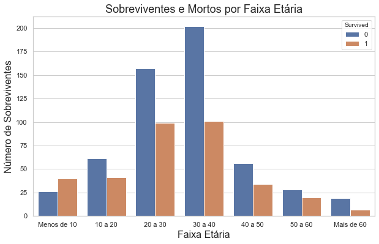


Podemos ver neste gráfico que quem tem menos de 10 anos teve uma chance maior de sobrevivencia. Já nas outras faixas etárias, apesar da chance de sobreviver ser menor, essa diferença não é tão grande quanto eu esperava ser. Acredito que o sexo deve influenciar de forma mais forte esse modelo.
Para tentar entender melhor, vamos quebrar esse gráfico por faixa etária, contando pelo sexo de cada pessageiro.

## Explorando a Relação de Sobreviventes e Mortos por Faixa Etária e Sexo.


```python
#Graficos de sobreviventes pelo sexo separados por idade.

#Criando dataframes de separados por idade.
menosDe10Anos = dfTrain.loc[dfTrain['Age']<10.0]
entre10e20Anos = dfTrain.query('Age>=10.0 and Age<20.0')
entre20e30Anos = dfTrain.query('Age>=20.0 and Age<30.0')
entre30e40Anos = dfTrain.query('Age>=30.0 and Age<40.0')
entre40e50Anos = dfTrain.query('Age>=40.0 and Age<50.0')
entre50e60Anos = dfTrain.query('Age>=50.0 and Age<60.0')
maisDe60Anos = dfTrain.loc[dfTrain['Age']>=60.0]

#Gerando os gráficos
fig, ax = plt.subplots(2,3,figsize=(18,12))
sns.countplot(x=menosDe10Anos.Sex, hue=menosDe10Anos.Survived, data=menosDe10Anos, ax=ax[0][0])
ax[0, 0].set_title('Sobreviventes x Sexo - menos de 10 Anos', fontsize=14)
sns.countplot(x=entre10e20Anos.Sex, hue=entre10e20Anos.Survived, data=entre10e20Anos, ax=ax[0][1])
ax[0, 1].set_title('Sobreviventes x Sexo - entre 10 e 20 Anos', fontsize=14)
sns.countplot(x=entre20e30Anos.Sex, hue=entre20e30Anos.Survived, data=entre20e30Anos, ax=ax[0][2])
ax[0, 2].set_title('Sobreviventes x Sexo - entre 20 e 30 Anos', fontsize=14)
sns.countplot(x=entre30e40Anos.Sex, hue=entre30e40Anos.Survived, data=entre30e40Anos, ax=ax[1][0])
ax[1, 0].set_title('Sobreviventes x Sexo - entre 30 e 40 Anos', fontsize=14)
sns.countplot(x=entre40e50Anos.Sex, hue=entre40e50Anos.Survived, data=entre40e50Anos, ax=ax[1][1])
ax[1, 1].set_title('Sobreviventes x Sexo - entre 40 e 50 Anos', fontsize=14)
sns.countplot(x=entre50e60Anos.Sex, hue=entre50e60Anos.Survived, data=entre50e60Anos, ax=ax[1][2])
ax[1, 2].set_title('Sobreviventes x Sexo - entre 50 e 60 Anos', fontsize=14)
plt.show()
plt.figure(figsize=(5.3,5.3))
ax=sns.countplot(x=maisDe60Anos.Sex, hue=maisDe60Anos.Survived, data=maisDe60Anos)
ax.set_title('Sobreviventes x Sexo - maiores de 60 Anos', fontsize=14)
plt.show()
```


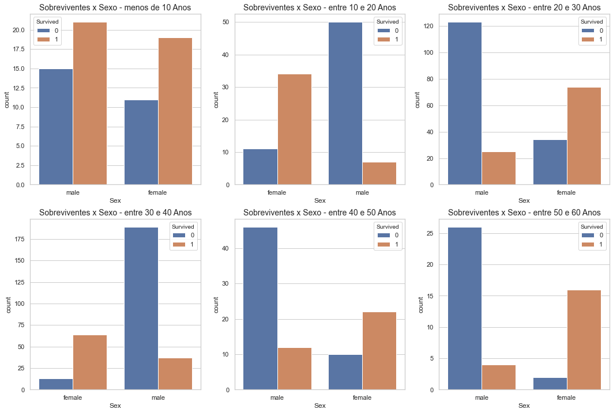


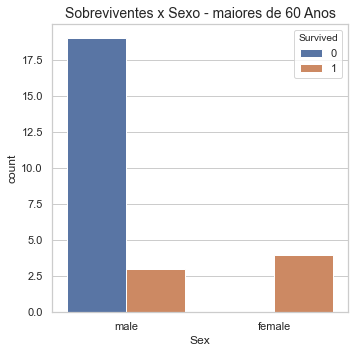


Agora sim podemos ter uma visão mais clara desses dados. Quem é mulher tem chance de sobrevivencia maior em qualquer faixa etária, não importando a idade, agora quem é homem, só tem mais chance de sobrevivencia quando tem menos de 10 anos, já nas outras faixas etárias, as chances são bem menores.
Portanto, com toda certeza o sexo é um fator importantissimo em nossa predição, como ja desconfiávamos antes, a idade também será um fator importante. Agora resta descobrir quais outros fatores vão influenciar em nosso modelo preidtivo.
Uma coluna que pode ser interessante é a "Pclass", pois, como sabemos do filme, as pessoas com menor poder aquisitivo, que acredito se encontrarem na 3ª classe ficaram presas no porão do navio, enquanto as com maior poder aquisitivo estavam desembarcando.

## Explorando a Relação de Sobreviventes e Mortos pela Classe.


```python
#Construindo o gráfico
sns.set(style="whitegrid")
plt.figure(figsize=(10,6))
ax = sns.countplot(x=dfTrain.Pclass, hue=dfTrain.Survived, data=dfTrain)
ax.xaxis.set_label_text("Tipo de Classe",fontdict= {'size':16})
ax.yaxis.set_label_text("Número de Sobreviventes", fontdict={'size':16})
ax.set_title("Sobreviventes e Mortos pelo Tipo de Classe", fontdict={'size':18})
plt.show()
```


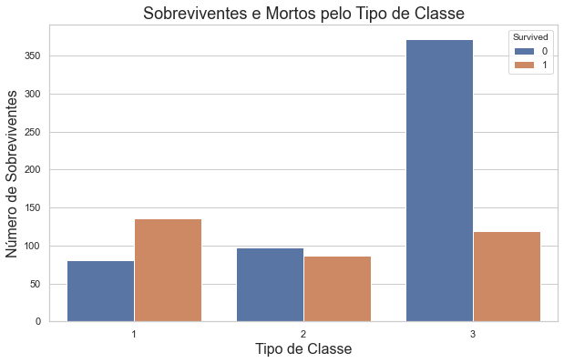


Como eu ja desconfiava, quem era da terceira classe teve poucas chances de sobrevivencia, já na segunda classe as chances são quase de 50% e n primeira a chance de sobrivencia é maior.
Agora que sabemos que o valor aquisitivo dos passageiros irá influenciar em nosso modelo preditvo podemos explorar também a taxa (Fare) paga por cada passageiro e ver se ela também nos tráz algum dado relevante.

## Explorando a Relação de Sobreviventes e Morotos pela Taxa (Fare) e a Idade.


```python
sns.set(style="white")
plt.figure(figsize=(10,6))

ax = sns.scatterplot(x=dfTrain.Fare, y=dfTrain.Age, hue=dfTrain.Survived, data=dfTrain)
ax.xaxis.set_label_text("Valor do Ticket",fontdict= {'size':16})
ax.yaxis.set_label_text("Idade", fontdict={'size':16})
ax.set_title("Valor do Ticket pela idade", fontdict={'size':18})
plt.show()
```


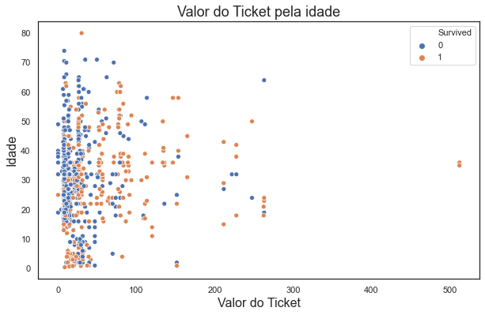


Como esses valores estão mal distribuídos (com dois valores muito altos) fica difícil analizar algo neste gráfico, vamos dividí-lo em duas parte, na primeira ficará quem pagou menos de 85 libras e na segunda quem pagou mais.


```python
#Criando os datasets
maisDe85 = dfTrain.query('Fare > 85')
menosDe85 = dfTrain.query('Fare <=85')

fig, ax = plt.subplots(1,2,figsize=(16,6))
sns.scatterplot(x=maisDe85.Fare, y=maisDe85.Age, hue=maisDe85.Survived, data=maisDe85, ax=ax[0])
ax[0].set_title('Taxa pela Idade com a identificação de Mortos de Sobrviventes', fontsize=14)
ax[0].xaxis.set_label_text("Taxa", fontsize=14)
ax[0].yaxis.set_label_text("Idade", fontsize=14)
sns.scatterplot(x=menosDe85.Fare, y=menosDe85.Age, hue=menosDe85.Survived, data=menosDe85, ax=ax[1])
ax[1].set_title('Taxa pela Idade com a identificação de Mortos de Sobrviventes', fontsize=14)
ax[1].xaxis.set_label_text("Taxa", fontsize=14)
ax[1].yaxis.set_label_text("Idade", fontsize=14)
plt.show()
```


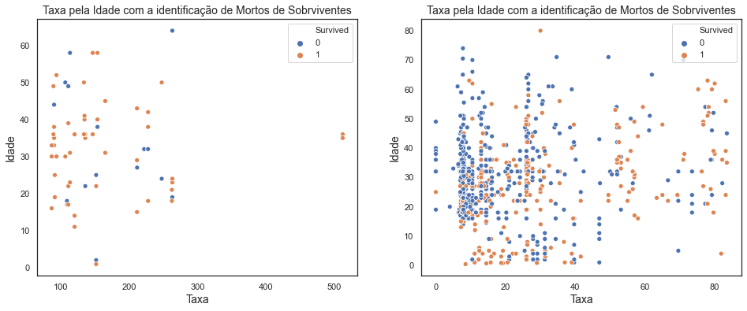


Agora podemos ter uma visão mais clara desses gráficos. Quem pagou mais caro, acima de 85 libras teve altas chances de sobrevivência, quem pagou entre 45 e 85 libras também teve boas chances de sobrevivência e esse percentual vai diminuindo a medida que o valor do ticket abaixa. Quem pagou menos de 17 libras por exemplo teve pouquissimas chances de sobrevivência.
Portanto podemos criar uma coluna FareRange que vai nos dar grupos de taxas pagas pelos passageiro, assim acredito que o modelo conseguirá fazer uma previsão melhor.


```python
bins = [-1, 16.999, 44.999, 85.999, 999]
valorTicket = ['Menos de 17','17 a 45','45 a 85','Mais de 85']
dfTrain['FareRange'] = pd.cut(dfTrain['Fare'], bins, labels=valorTicket)
dfTrain.head()
```


<div>
<style scoped>
    .dataframe tbody tr th:only-of-type {
        vertical-align: middle;
    }

    .dataframe tbody tr th {
        vertical-align: top;
    }

    .dataframe thead th {
        text-align: right;
    }
</style>
<table border="1" class="dataframe">
  <thead>
    <tr style="text-align: right;">
      <th></th>
      <th>PassengerId</th>
      <th>Survived</th>
      <th>Pclass</th>
      <th>Name</th>
      <th>Sex</th>
      <th>Age</th>
      <th>SibSp</th>
      <th>Parch</th>
      <th>Ticket</th>
      <th>Fare</th>
      <th>Cabin</th>
      <th>Embarked</th>
      <th>Title</th>
      <th>AgeRange</th>
      <th>FareRange</th>
    </tr>
  </thead>
  <tbody>
    <tr>
      <th>0</th>
      <td>1</td>
      <td>0</td>
      <td>3</td>
      <td>Braund, Mr. Owen Harris</td>
      <td>male</td>
      <td>22.0</td>
      <td>1</td>
      <td>0</td>
      <td>A/5 21171</td>
      <td>7.2500</td>
      <td>NaN</td>
      <td>S</td>
      <td>Mr</td>
      <td>20 a 30</td>
      <td>Menos de 17</td>
    </tr>
    <tr>
      <th>1</th>
      <td>2</td>
      <td>1</td>
      <td>1</td>
      <td>Cumings, Mrs. John Bradley (Florence Briggs Th...</td>
      <td>female</td>
      <td>38.0</td>
      <td>1</td>
      <td>0</td>
      <td>PC 17599</td>
      <td>71.2833</td>
      <td>C85</td>
      <td>C</td>
      <td>Mrs</td>
      <td>30 a 40</td>
      <td>45 a 85</td>
    </tr>
    <tr>
      <th>2</th>
      <td>3</td>
      <td>1</td>
      <td>3</td>
      <td>Heikkinen, Miss. Laina</td>
      <td>female</td>
      <td>26.0</td>
      <td>0</td>
      <td>0</td>
      <td>STON/O2. 3101282</td>
      <td>7.9250</td>
      <td>NaN</td>
      <td>S</td>
      <td>Miss</td>
      <td>20 a 30</td>
      <td>Menos de 17</td>
    </tr>
    <tr>
      <th>3</th>
      <td>4</td>
      <td>1</td>
      <td>1</td>
      <td>Futrelle, Mrs. Jacques Heath (Lily May Peel)</td>
      <td>female</td>
      <td>35.0</td>
      <td>1</td>
      <td>0</td>
      <td>113803</td>
      <td>53.1000</td>
      <td>C123</td>
      <td>S</td>
      <td>Mrs</td>
      <td>30 a 40</td>
      <td>45 a 85</td>
    </tr>
    <tr>
      <th>4</th>
      <td>5</td>
      <td>0</td>
      <td>3</td>
      <td>Allen, Mr. William Henry</td>
      <td>male</td>
      <td>35.0</td>
      <td>0</td>
      <td>0</td>
      <td>373450</td>
      <td>8.0500</td>
      <td>NaN</td>
      <td>S</td>
      <td>Mr</td>
      <td>30 a 40</td>
      <td>Menos de 17</td>
    </tr>
  </tbody>
</table>
</div>


Potanto para nossa primeira previsão vamos considerar as colunas "Plcas", "Sex", "AgeRage" e "FareRange". Vamos aos algoritmos!!

# Algorítmos para o 1º Modelo Preditivo

Antes de começar a gerar os algoritmo vamos criar o X e y de treino com as colunas do dataframe que usaremos em nossos modelos.


```python
#Criação de X_teste1 y_teste1
X_train1 = dfTrain.loc[:, ["Pclass", "Sex", "AgeRange", "FareRange"]]
y_train1 = dfTrain["Survived"]
```


```python
#Criando um "padrão" para a geração de números aleatórios.
np.random.seed(0)
```

Como as colunas do nosso dataframe são do tipo qualitativas, temos que transformá-las para que o algoritmo não interprete-as de forma errada. Para isso usamos a função OneHotEncoder, que transforma os valores da colunas em vetores, colocando um valor em cada índice dependendo do valor da variável.


```python
#Fazendo a transformação das colunas do dataframe
transCol = make_column_transformer((OneHotEncoder(), ['Pclass', 'Sex', 'AgeRange', 'FareRange']),
                                   remainder='passthrough')
```

## Regressão Logística


```python
#chamando a função LogisticRegression
logreg = LogisticRegression(solver='lbfgs')

#Usando o Pipeline para unir as duas funções acima.
pipe = Pipeline([
    ('trans', transCol),
    ('clf', logreg)
])

#Definindo os possíveis parâmetros para o função.
param_grid = {'clf__penalty': ['l1','l2'], 'clf__C': [0.001,0.01,0.1,1,10,100,1000]}

#Encontrando o melhor parâmetro para a função.
logreg_grid = GridSearchCV(pipe, param_grid, cv=10, refit=True, verbose=1, n_jobs=-1)

#Treinando o algorítmo com os parâmetros escolhidos.
logreg_grid.fit(X_train1, y_train1)

#Verificando a acuracia do modelo.
logreg_grid.best_score_
```

    Fitting 10 folds for each of 14 candidates, totalling 140 fits


    [Parallel(n_jobs=-1)]: Using backend LokyBackend with 4 concurrent workers.
    [Parallel(n_jobs=-1)]: Done  56 tasks      | elapsed:    3.7s
    [Parallel(n_jobs=-1)]: Done 140 out of 140 | elapsed:    4.7s finished


    0.7934706616729088


## K Nearest Neighbor (KNN)


```python
#chamando a função K Nearest Neighbor
knn = KNeighborsClassifier()

#Usando o Pipeline para unir as duas funções acima.
pipe = Pipeline([
    ('trans', transCol),
    ('clf', knn)
])

#Definindo os possíveis parâmetros para o função.
param_grid = {'clf__n_neighbors': list(range(1,31)), 'clf__weights':['uniform', 'distance']}

#Encontrando o melhor parâmetro para a função.
knn_grid = GridSearchCV(pipe, param_grid, cv=10, refit=True, verbose=1, n_jobs=-1)

#Treinando o algorítmo com os parâmetros escolhidos.
knn_grid.fit(X_train1, y_train1)

#Verificando a acuracia do modelo.
knn_grid.best_score_
```

    [Parallel(n_jobs=-1)]: Using backend LokyBackend with 4 concurrent workers.


    Fitting 10 folds for each of 60 candidates, totalling 600 fits


    [Parallel(n_jobs=-1)]: Done 200 tasks      | elapsed:    2.3s
    [Parallel(n_jobs=-1)]: Done 600 out of 600 | elapsed:    6.0s finished


    0.8148314606741573


## Support Vector Machines (SVC)


```python
#chamando a função SVC
svc = SVC()

#Usando o Pipeline para unir as duas funções acima.
pipe = Pipeline([
    ('trans', transCol),
    ('clf', svc)
])

#Definindo os possíveis parâmetros para o função.
param_grid = {'clf__C': [0.1,10, 100, 1000,5000], 'clf__gamma': [1,0.1,0.01,0.001,0.0001], 'clf__kernel': ['rbf']}

#Encontrando o melhor parâmetro para a função.
svc_grid = GridSearchCV(pipe, param_grid, cv=10, refit=True, verbose=1)

#Treinando o algorítmo com os parâmetros escolhidos.
svc_grid.fit(X_train1, y_train1)

#Verificando a acuracia do modelo.
svc_grid.best_score_
```

    [Parallel(n_jobs=1)]: Using backend SequentialBackend with 1 concurrent workers.


    Fitting 10 folds for each of 25 candidates, totalling 250 fits


    [Parallel(n_jobs=1)]: Done 250 out of 250 | elapsed:   15.4s finished


    0.8226217228464419


## Random Forest Classifier (RFC)


```python
## Random Forest Classifier (RFC)
#chamando a função RFC
rfc = RandomForestClassifier()

#Usando o Pipeline para unir as duas funções acima.
pipe = Pipeline([
    ('trans', transCol),
    ('clf', rfc)
])

#Definindo os possíveis parâmetros para o função.
param_grid = { 
    'clf__n_estimators': [200, 500],
    'clf__max_features': ['auto', 'sqrt', 'log2'],
    'clf__max_depth' : [4,5,6,7,8],
    'clf__criterion' :['gini', 'entropy']
}

#Encontrando o melhor parâmetro para a função.
rfc_grid = GridSearchCV(pipe, param_grid, cv=10, refit=True, verbose=1)

#Treinando o algorítmo com os parâmetros escolhidos.
rfc_grid.fit(X_train1,y_train1)

#Verificando a acuracia do modelo.
rfc_grid.best_score_
```

    [Parallel(n_jobs=1)]: Using backend SequentialBackend with 1 concurrent workers.


    Fitting 10 folds for each of 60 candidates, totalling 600 fits


    [Parallel(n_jobs=1)]: Done 600 out of 600 | elapsed:  8.0min finished


    0.8293383270911361


## Árvore de Decisão (Decision Tree Classifier)


```python
#chamando a função Decision Tree Classifier
tree = DecisionTreeClassifier()

#Usando o Pipeline para unir as duas funções acima.
pipe = Pipeline([
    ('trans', transCol),
    ('clf', tree)
])

#Definindo os possíveis parâmetros para o função.
param_grid = {'clf__criterion':['gini','entropy'],'clf__max_depth':[4,5,6,7,8,9,10,11,12,15,20,30,40,50,70,90,120,150]}

#Encontrando o melhor parâmetro para a função.
tree_grid = GridSearchCV(pipe, param_grid, cv=20, refit=True, verbose=1)

#Treinando o algorítmo com os parâmetros escolhidos.
tree_grid.fit(X_train1, y_train1)

#Verificando a acurácia do modelo.
tree_grid.best_score_
```

    Fitting 20 folds for each of 36 candidates, totalling 720 fits


    [Parallel(n_jobs=1)]: Using backend SequentialBackend with 1 concurrent workers.
    [Parallel(n_jobs=1)]: Done 720 out of 720 | elapsed:   10.0s finished


    0.8281818181818181


Apesar do tempo de execução altissimo, comparado aos outros programas, o Random Forest Classifier nos deu a melhor solução até o momento, portanto iremos utilizar ele em nossa primeira predição.

# 1ª predição para o problema do Titanic.

Antes de fazer a previsão precisamos ler os nossos dados de teste do titanic, verificar se existe algum valor nulo e criar as colunas que serão utilizadas em nosso código.


```python
#Lendo o arquivo 'test' do titanic.
dfTest = pd.read_csv('https://raw.githubusercontent.com/fthara/titanicKaggle/master/dataSets/test.csv')
dfTest.head()
```


<div>
<style scoped>
    .dataframe tbody tr th:only-of-type {
        vertical-align: middle;
    }

    .dataframe tbody tr th {
        vertical-align: top;
    }

    .dataframe thead th {
        text-align: right;
    }
</style>
<table border="1" class="dataframe">
  <thead>
    <tr style="text-align: right;">
      <th></th>
      <th>PassengerId</th>
      <th>Pclass</th>
      <th>Name</th>
      <th>Sex</th>
      <th>Age</th>
      <th>SibSp</th>
      <th>Parch</th>
      <th>Ticket</th>
      <th>Fare</th>
      <th>Cabin</th>
      <th>Embarked</th>
    </tr>
  </thead>
  <tbody>
    <tr>
      <th>0</th>
      <td>892</td>
      <td>3</td>
      <td>Kelly, Mr. James</td>
      <td>male</td>
      <td>34.5</td>
      <td>0</td>
      <td>0</td>
      <td>330911</td>
      <td>7.8292</td>
      <td>NaN</td>
      <td>Q</td>
    </tr>
    <tr>
      <th>1</th>
      <td>893</td>
      <td>3</td>
      <td>Wilkes, Mrs. James (Ellen Needs)</td>
      <td>female</td>
      <td>47.0</td>
      <td>1</td>
      <td>0</td>
      <td>363272</td>
      <td>7.0000</td>
      <td>NaN</td>
      <td>S</td>
    </tr>
    <tr>
      <th>2</th>
      <td>894</td>
      <td>2</td>
      <td>Myles, Mr. Thomas Francis</td>
      <td>male</td>
      <td>62.0</td>
      <td>0</td>
      <td>0</td>
      <td>240276</td>
      <td>9.6875</td>
      <td>NaN</td>
      <td>Q</td>
    </tr>
    <tr>
      <th>3</th>
      <td>895</td>
      <td>3</td>
      <td>Wirz, Mr. Albert</td>
      <td>male</td>
      <td>27.0</td>
      <td>0</td>
      <td>0</td>
      <td>315154</td>
      <td>8.6625</td>
      <td>NaN</td>
      <td>S</td>
    </tr>
    <tr>
      <th>4</th>
      <td>896</td>
      <td>3</td>
      <td>Hirvonen, Mrs. Alexander (Helga E Lindqvist)</td>
      <td>female</td>
      <td>22.0</td>
      <td>1</td>
      <td>1</td>
      <td>3101298</td>
      <td>12.2875</td>
      <td>NaN</td>
      <td>S</td>
    </tr>
  </tbody>
</table>
</div>


```python
dfTest.isna().sum()
```


    PassengerId      0
    Pclass           0
    Name             0
    Sex              0
    Age             86
    SibSp            0
    Parch            0
    Ticket           0
    Fare             1
    Cabin          327
    Embarked         0
    dtype: int64


Existem 86 variáveis nulas em "Age" e 1 variável nula em "Fare", precisamos arrumar isso para o algoritmo possa rodar sem problemas.
Para solucionar este problema em "Age", vamos usar a mesma estratégia usada anteriormente, mantendo o padrão. Usaremos a mesma estratégia em Fare também, mas comparando com a média da classe de cada passageiro.
Vamos começar por age então:


```python
#Criando a variável título.

#Separando o primero nome do ultimo nome.
new = dfTest["Name"].str.split(",", n = 1, expand = True)
#Adicionando a coluna LastName ao dataframe, que conterá o Título e o resto do nome.
dfTest["LastName"]= new[1] 
#Separando o título do resto do nome.
new = dfTest["LastName"].str.split(".", n = 1, expand = True) 
#Adicionando a coluna Title com o título.
dfTest["Title"]= new[0]
dfTest.drop(columns="LastName", inplace=True)
#A função strip() remove os espaços no começo e no fim de uma string.
dfTest['Title']=dfTest['Title'].str.strip()
dfTest.head()
```


<div>
<style scoped>
    .dataframe tbody tr th:only-of-type {
        vertical-align: middle;
    }

    .dataframe tbody tr th {
        vertical-align: top;
    }

    .dataframe thead th {
        text-align: right;
    }
</style>
<table border="1" class="dataframe">
  <thead>
    <tr style="text-align: right;">
      <th></th>
      <th>PassengerId</th>
      <th>Pclass</th>
      <th>Name</th>
      <th>Sex</th>
      <th>Age</th>
      <th>SibSp</th>
      <th>Parch</th>
      <th>Ticket</th>
      <th>Fare</th>
      <th>Cabin</th>
      <th>Embarked</th>
      <th>Title</th>
    </tr>
  </thead>
  <tbody>
    <tr>
      <th>0</th>
      <td>892</td>
      <td>3</td>
      <td>Kelly, Mr. James</td>
      <td>male</td>
      <td>34.5</td>
      <td>0</td>
      <td>0</td>
      <td>330911</td>
      <td>7.8292</td>
      <td>NaN</td>
      <td>Q</td>
      <td>Mr</td>
    </tr>
    <tr>
      <th>1</th>
      <td>893</td>
      <td>3</td>
      <td>Wilkes, Mrs. James (Ellen Needs)</td>
      <td>female</td>
      <td>47.0</td>
      <td>1</td>
      <td>0</td>
      <td>363272</td>
      <td>7.0000</td>
      <td>NaN</td>
      <td>S</td>
      <td>Mrs</td>
    </tr>
    <tr>
      <th>2</th>
      <td>894</td>
      <td>2</td>
      <td>Myles, Mr. Thomas Francis</td>
      <td>male</td>
      <td>62.0</td>
      <td>0</td>
      <td>0</td>
      <td>240276</td>
      <td>9.6875</td>
      <td>NaN</td>
      <td>Q</td>
      <td>Mr</td>
    </tr>
    <tr>
      <th>3</th>
      <td>895</td>
      <td>3</td>
      <td>Wirz, Mr. Albert</td>
      <td>male</td>
      <td>27.0</td>
      <td>0</td>
      <td>0</td>
      <td>315154</td>
      <td>8.6625</td>
      <td>NaN</td>
      <td>S</td>
      <td>Mr</td>
    </tr>
    <tr>
      <th>4</th>
      <td>896</td>
      <td>3</td>
      <td>Hirvonen, Mrs. Alexander (Helga E Lindqvist)</td>
      <td>female</td>
      <td>22.0</td>
      <td>1</td>
      <td>1</td>
      <td>3101298</td>
      <td>12.2875</td>
      <td>NaN</td>
      <td>S</td>
      <td>Mrs</td>
    </tr>
  </tbody>
</table>
</div>


```python
#Aplicando a função map nos valores nulos com a mediaIdade calculada anteriormente para substituí-los.
dfTest.loc[dfTest['Age'].isna()==True, 'Age'] = dfTest.loc[dfTest['Age'].isna()==True, 'Title'].map(mediaIdade)
dfTest.Age.isna().value_counts()
```


    False    418
    Name: Age, dtype: int64


Pronto, agora vamos fazer o mesmo procedimento com a coluna Fare.


```python
#Calculando a média de taxa por classe transformando em um dicionário.
mediaFare = dfTest.loc[dfTest['Fare'].isnull()==False]
mediaFare = mediaFare.groupby('Pclass')['Fare'].mean().round()
mediaFare = dict(mediaFare)
print(mediaFare)
```

    {1: 94.0, 2: 22.0, 3: 12.0}


```python
#Aplicando a função map nos valores nulos com a mediaFare calculada para substituí-los.
dfTest.loc[dfTest['Fare'].isna()==True, 'Fare'] = dfTest.loc[dfTest['Fare'].isna()==True, 'Pclass'].map(mediaFare)
dfTest.Fare.isna().value_counts()
```


    False    418
    Name: Fare, dtype: int64


Agora vamos criar a coluna AgeRange


```python
#Criando  coluna AgeRange.
bins = [0, 9.99, 19.99, 29.99, 39.99, 49.99, 59.99, 999]
faixaEtaria = ['Menos de 10','10 a 20','20 a 30', '30 a 40', '40 a 50', '50 a 60', 'Mais de 60']
dfTest['AgeRange'] = pd.cut(dfTest['Age'], bins, labels=faixaEtaria)
dfTest.head()
```


<div>
<style scoped>
    .dataframe tbody tr th:only-of-type {
        vertical-align: middle;
    }

    .dataframe tbody tr th {
        vertical-align: top;
    }

    .dataframe thead th {
        text-align: right;
    }
</style>
<table border="1" class="dataframe">
  <thead>
    <tr style="text-align: right;">
      <th></th>
      <th>PassengerId</th>
      <th>Pclass</th>
      <th>Name</th>
      <th>Sex</th>
      <th>Age</th>
      <th>SibSp</th>
      <th>Parch</th>
      <th>Ticket</th>
      <th>Fare</th>
      <th>Cabin</th>
      <th>Embarked</th>
      <th>Title</th>
      <th>AgeRange</th>
    </tr>
  </thead>
  <tbody>
    <tr>
      <th>0</th>
      <td>892</td>
      <td>3</td>
      <td>Kelly, Mr. James</td>
      <td>male</td>
      <td>34.5</td>
      <td>0</td>
      <td>0</td>
      <td>330911</td>
      <td>7.8292</td>
      <td>NaN</td>
      <td>Q</td>
      <td>Mr</td>
      <td>30 a 40</td>
    </tr>
    <tr>
      <th>1</th>
      <td>893</td>
      <td>3</td>
      <td>Wilkes, Mrs. James (Ellen Needs)</td>
      <td>female</td>
      <td>47.0</td>
      <td>1</td>
      <td>0</td>
      <td>363272</td>
      <td>7.0000</td>
      <td>NaN</td>
      <td>S</td>
      <td>Mrs</td>
      <td>40 a 50</td>
    </tr>
    <tr>
      <th>2</th>
      <td>894</td>
      <td>2</td>
      <td>Myles, Mr. Thomas Francis</td>
      <td>male</td>
      <td>62.0</td>
      <td>0</td>
      <td>0</td>
      <td>240276</td>
      <td>9.6875</td>
      <td>NaN</td>
      <td>Q</td>
      <td>Mr</td>
      <td>Mais de 60</td>
    </tr>
    <tr>
      <th>3</th>
      <td>895</td>
      <td>3</td>
      <td>Wirz, Mr. Albert</td>
      <td>male</td>
      <td>27.0</td>
      <td>0</td>
      <td>0</td>
      <td>315154</td>
      <td>8.6625</td>
      <td>NaN</td>
      <td>S</td>
      <td>Mr</td>
      <td>20 a 30</td>
    </tr>
    <tr>
      <th>4</th>
      <td>896</td>
      <td>3</td>
      <td>Hirvonen, Mrs. Alexander (Helga E Lindqvist)</td>
      <td>female</td>
      <td>22.0</td>
      <td>1</td>
      <td>1</td>
      <td>3101298</td>
      <td>12.2875</td>
      <td>NaN</td>
      <td>S</td>
      <td>Mrs</td>
      <td>20 a 30</td>
    </tr>
  </tbody>
</table>
</div>


Só falta criar a coluna FareRange para podermos gerar nossos dados preditivos.


```python
bins = [-1, 16.999, 44.999, 85.999, 999]
valorTicket = ['Menos de 17','17 a 45','45 a 85','Mais de 85']
dfTest['FareRange'] = pd.cut(dfTest['Fare'], bins, labels=valorTicket)
dfTest.head()
```


<div>
<style scoped>
    .dataframe tbody tr th:only-of-type {
        vertical-align: middle;
    }

    .dataframe tbody tr th {
        vertical-align: top;
    }

    .dataframe thead th {
        text-align: right;
    }
</style>
<table border="1" class="dataframe">
  <thead>
    <tr style="text-align: right;">
      <th></th>
      <th>PassengerId</th>
      <th>Pclass</th>
      <th>Name</th>
      <th>Sex</th>
      <th>Age</th>
      <th>SibSp</th>
      <th>Parch</th>
      <th>Ticket</th>
      <th>Fare</th>
      <th>Cabin</th>
      <th>Embarked</th>
      <th>Title</th>
      <th>AgeRange</th>
      <th>FareRange</th>
    </tr>
  </thead>
  <tbody>
    <tr>
      <th>0</th>
      <td>892</td>
      <td>3</td>
      <td>Kelly, Mr. James</td>
      <td>male</td>
      <td>34.5</td>
      <td>0</td>
      <td>0</td>
      <td>330911</td>
      <td>7.8292</td>
      <td>NaN</td>
      <td>Q</td>
      <td>Mr</td>
      <td>30 a 40</td>
      <td>Menos de 17</td>
    </tr>
    <tr>
      <th>1</th>
      <td>893</td>
      <td>3</td>
      <td>Wilkes, Mrs. James (Ellen Needs)</td>
      <td>female</td>
      <td>47.0</td>
      <td>1</td>
      <td>0</td>
      <td>363272</td>
      <td>7.0000</td>
      <td>NaN</td>
      <td>S</td>
      <td>Mrs</td>
      <td>40 a 50</td>
      <td>Menos de 17</td>
    </tr>
    <tr>
      <th>2</th>
      <td>894</td>
      <td>2</td>
      <td>Myles, Mr. Thomas Francis</td>
      <td>male</td>
      <td>62.0</td>
      <td>0</td>
      <td>0</td>
      <td>240276</td>
      <td>9.6875</td>
      <td>NaN</td>
      <td>Q</td>
      <td>Mr</td>
      <td>Mais de 60</td>
      <td>Menos de 17</td>
    </tr>
    <tr>
      <th>3</th>
      <td>895</td>
      <td>3</td>
      <td>Wirz, Mr. Albert</td>
      <td>male</td>
      <td>27.0</td>
      <td>0</td>
      <td>0</td>
      <td>315154</td>
      <td>8.6625</td>
      <td>NaN</td>
      <td>S</td>
      <td>Mr</td>
      <td>20 a 30</td>
      <td>Menos de 17</td>
    </tr>
    <tr>
      <th>4</th>
      <td>896</td>
      <td>3</td>
      <td>Hirvonen, Mrs. Alexander (Helga E Lindqvist)</td>
      <td>female</td>
      <td>22.0</td>
      <td>1</td>
      <td>1</td>
      <td>3101298</td>
      <td>12.2875</td>
      <td>NaN</td>
      <td>S</td>
      <td>Mrs</td>
      <td>20 a 30</td>
      <td>Menos de 17</td>
    </tr>
  </tbody>
</table>
</div>


Vamos criar o X de teste para fazermos a predição.


```python
#Criando o X teste.
X_test1 = dfTest.loc[:, ["Pclass", "Sex", "AgeRange", "FareRange"]]
X_test1.head()
```


<div>
<style scoped>
    .dataframe tbody tr th:only-of-type {
        vertical-align: middle;
    }

    .dataframe tbody tr th {
        vertical-align: top;
    }

    .dataframe thead th {
        text-align: right;
    }
</style>
<table border="1" class="dataframe">
  <thead>
    <tr style="text-align: right;">
      <th></th>
      <th>Pclass</th>
      <th>Sex</th>
      <th>AgeRange</th>
      <th>FareRange</th>
    </tr>
  </thead>
  <tbody>
    <tr>
      <th>0</th>
      <td>3</td>
      <td>male</td>
      <td>30 a 40</td>
      <td>Menos de 17</td>
    </tr>
    <tr>
      <th>1</th>
      <td>3</td>
      <td>female</td>
      <td>40 a 50</td>
      <td>Menos de 17</td>
    </tr>
    <tr>
      <th>2</th>
      <td>2</td>
      <td>male</td>
      <td>Mais de 60</td>
      <td>Menos de 17</td>
    </tr>
    <tr>
      <th>3</th>
      <td>3</td>
      <td>male</td>
      <td>20 a 30</td>
      <td>Menos de 17</td>
    </tr>
    <tr>
      <th>4</th>
      <td>3</td>
      <td>female</td>
      <td>20 a 30</td>
      <td>Menos de 17</td>
    </tr>
  </tbody>
</table>
</div>


```python
#Gerando a resposta
#y_test1 = rfc_grid.predict(X_test1)
y_test1 = tree_grid.predict(X_test1)
print(y_test1)
```

    [0 0 0 0 1 0 0 0 1 0 0 0 1 0 1 1 0 0 1 0 0 1 1 0 1 0 1 0 0 0 0 0 0 0 0 0 1
     1 0 0 0 0 0 1 1 0 0 0 1 0 0 0 1 1 0 0 0 0 0 1 0 0 0 1 0 1 1 0 0 1 1 0 1 0
     1 0 0 1 0 1 1 0 0 0 0 0 1 1 1 1 1 0 1 0 0 0 1 0 1 0 1 0 0 0 1 0 0 0 0 0 0
     1 1 1 1 0 0 1 0 1 1 0 1 0 0 1 0 0 0 0 0 0 0 0 0 0 0 0 1 0 0 1 0 0 0 0 0 0
     0 0 1 0 0 0 0 0 1 1 0 1 1 1 1 0 0 0 0 0 1 1 0 0 0 0 0 1 1 0 1 1 0 0 1 0 1
     0 1 0 0 0 0 0 0 0 1 0 1 1 0 0 1 1 0 1 0 0 0 0 1 0 0 0 0 1 0 0 1 0 1 0 1 0
     1 0 1 0 0 1 0 0 0 1 0 0 0 0 0 0 1 1 1 1 0 0 0 0 1 0 1 0 1 0 0 0 0 0 0 0 1
     0 0 0 1 1 0 0 0 0 1 0 0 0 1 1 0 1 0 0 0 0 1 1 1 1 0 0 0 0 0 0 0 0 0 0 0 0
     1 0 0 0 0 0 0 0 1 1 0 1 0 0 0 0 0 0 1 1 0 0 0 0 0 0 0 0 1 0 1 0 0 0 1 0 0
     1 0 0 0 0 0 1 0 0 0 1 1 1 0 0 0 1 1 0 0 0 0 0 1 0 0 0 0 1 1 0 1 0 0 0 1 0
     0 1 0 0 1 1 1 0 0 0 0 0 0 1 0 1 0 0 0 0 0 1 0 0 0 1 0 1 0 0 1 0 1 0 0 0 0
     0 1 1 1 1 1 0 1 0 0 0]


```python
#Criando a série com a resposta.
predict1 = pd.Series(y_test1, index=dfTest["PassengerId"])
predict1.to_csv(r'dataSets/predict1.csv', header=True)
```


```python
#Mostrando os 5 primeiros elementos da série.
!head -n5 dataSets/predict1.csv
```

    PassengerId,0
    892,0
    893,0
    894,0
    895,0


Nesta primeira previsão eu consegui 76% de score, o que não é tão ruim assim, mas acreditei que dava para melhorar, então fui analizar o meu dataframe para ver o que eu podia fazer.
Vamos abrir novamente nosso dataset:


```python
dfTrain.head()
```


<div>
<style scoped>
    .dataframe tbody tr th:only-of-type {
        vertical-align: middle;
    }

    .dataframe tbody tr th {
        vertical-align: top;
    }

    .dataframe thead th {
        text-align: right;
    }
</style>
<table border="1" class="dataframe">
  <thead>
    <tr style="text-align: right;">
      <th></th>
      <th>PassengerId</th>
      <th>Survived</th>
      <th>Pclass</th>
      <th>Name</th>
      <th>Sex</th>
      <th>Age</th>
      <th>SibSp</th>
      <th>Parch</th>
      <th>Ticket</th>
      <th>Fare</th>
      <th>Cabin</th>
      <th>Embarked</th>
      <th>Title</th>
      <th>AgeRange</th>
      <th>FareRange</th>
    </tr>
  </thead>
  <tbody>
    <tr>
      <th>0</th>
      <td>1</td>
      <td>0</td>
      <td>3</td>
      <td>Braund, Mr. Owen Harris</td>
      <td>male</td>
      <td>22.0</td>
      <td>1</td>
      <td>0</td>
      <td>A/5 21171</td>
      <td>7.2500</td>
      <td>NaN</td>
      <td>S</td>
      <td>Mr</td>
      <td>20 a 30</td>
      <td>Menos de 17</td>
    </tr>
    <tr>
      <th>1</th>
      <td>2</td>
      <td>1</td>
      <td>1</td>
      <td>Cumings, Mrs. John Bradley (Florence Briggs Th...</td>
      <td>female</td>
      <td>38.0</td>
      <td>1</td>
      <td>0</td>
      <td>PC 17599</td>
      <td>71.2833</td>
      <td>C85</td>
      <td>C</td>
      <td>Mrs</td>
      <td>30 a 40</td>
      <td>45 a 85</td>
    </tr>
    <tr>
      <th>2</th>
      <td>3</td>
      <td>1</td>
      <td>3</td>
      <td>Heikkinen, Miss. Laina</td>
      <td>female</td>
      <td>26.0</td>
      <td>0</td>
      <td>0</td>
      <td>STON/O2. 3101282</td>
      <td>7.9250</td>
      <td>NaN</td>
      <td>S</td>
      <td>Miss</td>
      <td>20 a 30</td>
      <td>Menos de 17</td>
    </tr>
    <tr>
      <th>3</th>
      <td>4</td>
      <td>1</td>
      <td>1</td>
      <td>Futrelle, Mrs. Jacques Heath (Lily May Peel)</td>
      <td>female</td>
      <td>35.0</td>
      <td>1</td>
      <td>0</td>
      <td>113803</td>
      <td>53.1000</td>
      <td>C123</td>
      <td>S</td>
      <td>Mrs</td>
      <td>30 a 40</td>
      <td>45 a 85</td>
    </tr>
    <tr>
      <th>4</th>
      <td>5</td>
      <td>0</td>
      <td>3</td>
      <td>Allen, Mr. William Henry</td>
      <td>male</td>
      <td>35.0</td>
      <td>0</td>
      <td>0</td>
      <td>373450</td>
      <td>8.0500</td>
      <td>NaN</td>
      <td>S</td>
      <td>Mr</td>
      <td>30 a 40</td>
      <td>Menos de 17</td>
    </tr>
  </tbody>
</table>
</div>


# Segunda exploração dos dados

Uma primeira tentativa que podemos fazer é uma análise com relação aos familiares. Para isso, precisamos somar as colunas SibSp e Parch, assim saberemos quantos familiáres de um certo passageiro estão a bordo.
Vamos criar a coluna FamilySize:


```python
dfTrain["FamilySize"] = dfTrain["SibSp"] + dfTrain["Parch"]
dfTrain.head()
```


<div>
<style scoped>
    .dataframe tbody tr th:only-of-type {
        vertical-align: middle;
    }

    .dataframe tbody tr th {
        vertical-align: top;
    }

    .dataframe thead th {
        text-align: right;
    }
</style>
<table border="1" class="dataframe">
  <thead>
    <tr style="text-align: right;">
      <th></th>
      <th>PassengerId</th>
      <th>Survived</th>
      <th>Pclass</th>
      <th>Name</th>
      <th>Sex</th>
      <th>Age</th>
      <th>SibSp</th>
      <th>Parch</th>
      <th>Ticket</th>
      <th>Fare</th>
      <th>Cabin</th>
      <th>Embarked</th>
      <th>Title</th>
      <th>AgeRange</th>
      <th>FareRange</th>
      <th>FamilySize</th>
    </tr>
  </thead>
  <tbody>
    <tr>
      <th>0</th>
      <td>1</td>
      <td>0</td>
      <td>3</td>
      <td>Braund, Mr. Owen Harris</td>
      <td>male</td>
      <td>22.0</td>
      <td>1</td>
      <td>0</td>
      <td>A/5 21171</td>
      <td>7.2500</td>
      <td>NaN</td>
      <td>S</td>
      <td>Mr</td>
      <td>20 a 30</td>
      <td>Menos de 17</td>
      <td>1</td>
    </tr>
    <tr>
      <th>1</th>
      <td>2</td>
      <td>1</td>
      <td>1</td>
      <td>Cumings, Mrs. John Bradley (Florence Briggs Th...</td>
      <td>female</td>
      <td>38.0</td>
      <td>1</td>
      <td>0</td>
      <td>PC 17599</td>
      <td>71.2833</td>
      <td>C85</td>
      <td>C</td>
      <td>Mrs</td>
      <td>30 a 40</td>
      <td>45 a 85</td>
      <td>1</td>
    </tr>
    <tr>
      <th>2</th>
      <td>3</td>
      <td>1</td>
      <td>3</td>
      <td>Heikkinen, Miss. Laina</td>
      <td>female</td>
      <td>26.0</td>
      <td>0</td>
      <td>0</td>
      <td>STON/O2. 3101282</td>
      <td>7.9250</td>
      <td>NaN</td>
      <td>S</td>
      <td>Miss</td>
      <td>20 a 30</td>
      <td>Menos de 17</td>
      <td>0</td>
    </tr>
    <tr>
      <th>3</th>
      <td>4</td>
      <td>1</td>
      <td>1</td>
      <td>Futrelle, Mrs. Jacques Heath (Lily May Peel)</td>
      <td>female</td>
      <td>35.0</td>
      <td>1</td>
      <td>0</td>
      <td>113803</td>
      <td>53.1000</td>
      <td>C123</td>
      <td>S</td>
      <td>Mrs</td>
      <td>30 a 40</td>
      <td>45 a 85</td>
      <td>1</td>
    </tr>
    <tr>
      <th>4</th>
      <td>5</td>
      <td>0</td>
      <td>3</td>
      <td>Allen, Mr. William Henry</td>
      <td>male</td>
      <td>35.0</td>
      <td>0</td>
      <td>0</td>
      <td>373450</td>
      <td>8.0500</td>
      <td>NaN</td>
      <td>S</td>
      <td>Mr</td>
      <td>30 a 40</td>
      <td>Menos de 17</td>
      <td>0</td>
    </tr>
  </tbody>
</table>
</div>


## Análise de Familiares

Vamos plotar o gráfico de sobreviventes pela quantidade de familiares e tentar encontrar alguma relação entre eles.


```python
# Plotando o gráfico de countplot
fig, ax = plt.subplots(1,1, figsize=(10,6))
ax = sns.countplot(x=dfTrain.FamilySize, hue=dfTrain.Survived, data=dfTrain)
ax.set_title("Número de Pessoas pelo Tamanho da Família", fontdict={'size':16})
ax.xaxis.set_label_text("Quantidade de Familiares",fontdict={'size':14})
ax.yaxis.set_label_text("Número de Pessoas", fontdict={'size':14})
plt.show()
```


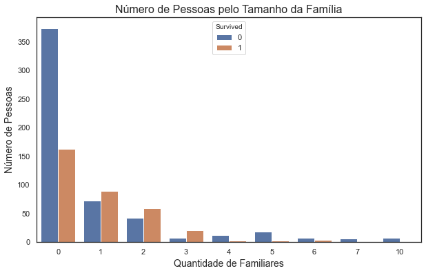


Podemos perceber que quem tem de 1 a 3 familiares teve uma chance maior de sobrevivência, já quem tem nenhum ou mais de 3 familiares não teve poucas chances e em alguns casos, nenhuma chance. Sinceramente, eu não esperava que a quantidade de familiares faria diferença em nosso modelo, mas aparentemente faz, por isso, vamos incluí-lo.
Outra análise que pode ser interessante é quanto ao título de cada passageiro, pois acredito que quem tinha um título de importancia, como Coronel, ou Doutor, teve mais chance do que quem não tinha um título muito importante.

## Análise por Título

Vamos gerar o gráfico do Título da pessoa em relação ao número de sobreviventes e mortos.


```python
# Plotando o gráfico de countplot
fig, ax = plt.subplots(1,1, figsize=(10, 6))
ax = sns.countplot(x=dfTrain.Title, hue=dfTrain.Survived, data=dfTrain)
ax.set_title("Número de Pessoas pelo Títlulo", fontdict={'size':16})
ax.xaxis.set_label_text("Título",fontdict={'size':14})
ax.yaxis.set_label_text("Número de Pessoas", fontdict={'size':14})
ax.set_xticklabels(ax.get_xticklabels(), rotation=45)
plt.show()
```


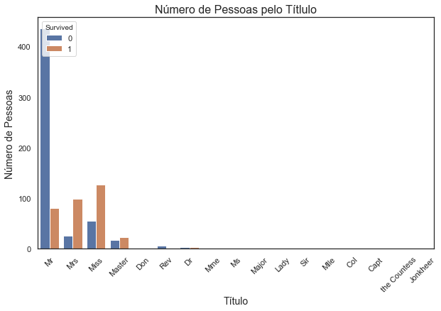


Este gráfico está com uma visualização péssima devido ao número de "Mr" ser muito grande com relação aos outros passageiros, vamos dividí-lo em duas partes para facilitar a visualização.


```python
title1 = dfTrain.query('Title == ["Mr", "Mrs", "Miss", "Master"]')
title2 = dfTrain.query('Title == ["Don", "Rev", "Dr", "Mme", "Ms", "Major", "Lady", "Sir", ''\
                       "Mlle", "Col", "Capt", "the Countess", "Jonkheer"]')
```


```python
# Plotando os gráfico um do lado do outro.

fig, ax = plt.subplots(1,2, figsize=(16, 6))

#Gráfico 1
sns.countplot(x=title1.Title, hue=title1.Survived, ax=ax[0])
ax[0].set_title("Número de Pessoas pelo Títlulo", fontdict={'size':16})
ax[0].xaxis.set_label_text("Título",fontdict={'size':14})
ax[0].yaxis.set_label_text("Número de Pessoas", fontdict={'size':14})
ax[0].set_xticklabels(ax[0].get_xticklabels(), rotation=45)

#Gráfico 2
sns.countplot(x=title2.Title, hue=title2.Survived, ax=ax[1])
ax[1].set_title("Número de Pessoas pelo Títlulo", fontdict={'size':16})
ax[1].xaxis.set_label_text("Título",fontdict={'size':14})
ax[1].yaxis.set_label_text("Número de Pessoas", fontdict={'size':14})
ax[1].set_xticklabels(ax[1].get_xticklabels(), rotation=45)

plt.show()
```


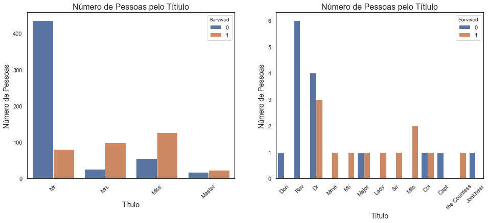


Realmente, o título parece fazer muita diferença, pois nele conseguimos separar em sua maioria as mulheres dos homens, crianças de adultos e ainda percebemos alguns títulos importantes, como "Col" e "Dr". Portanto a coluna Title também será acrescentada em nosso modelo preditivo.
Antes de gerar os algorítmos, vou juntar algumas categorias, pois existem poucos passageiros nelas e também para que não fique muito pesado para rodar o algoritmo. Se olharmos no segundo gráfico percebemos que os passageiros de título 'Don', 'Rev', 'Capt' e 'Jonkeer', todos morreram, então vou renomeá-los de "othersDead", já os passageiros de título 'Mme', 'Ms' e 'Lady', todos sobreviveram, então vou renomeá-los de "othesAlive" e os passageiros de título 'Col' e 'Major' tiveram 50% de chance de sobreviver, então vou renomeá-los de "others50perc"


```python
#Criando um dicionário para renomear os passageiros:
othersDead = {'Don':'othersDead', 'Rev':'othersDead', 'Capt':'othersDead', 'Jonkheer':'othersDead'}
othersAlive = {'Mme':'othersAlive', 'Ms':'othersAlive', 'Lady':'othersAlive',
               'Sir':'othersAlive', 'Mlle': 'othersAlive', 'the Countess':'othersAlive'}
others50perc = {'Major': 'others50perc', 'Col': 'others50perc'}
```


```python
#Renomeando os passageiros
dfTrain["Title"].replace(othersDead, inplace=True)
dfTrain["Title"].replace(othersAlive, inplace=True)
dfTrain["Title"].replace(others50perc, inplace=True)
#Verificando se a renomeação deu certo
dfTrain.Title.value_counts(dropna=False)
```


    Mr              517
    Miss            182
    Mrs             125
    Master           40
    othersDead        9
    Dr                7
    othersAlive       7
    others50perc      4
    Name: Title, dtype: int64


# Algorítmos para o 2º Modelo Preditivo


```python
#Criação de X_teste1 y_teste1
X_train2 = dfTrain.loc[:, ["Pclass", "Sex", "Title", "AgeRange", "FareRange", "FamilySize"]]
y_train2 = dfTrain["Survived"]
```


```python
#Fazendo a transformação das colunas do dataframe
transCol = make_column_transformer((OneHotEncoder(), ["Pclass", "Sex", "Title", "AgeRange", "FareRange", "FamilySize"]),
                                   remainder='passthrough')
```

## Regressão Logística


```python
#chamando a função LogisticRegression
logreg = LogisticRegression(solver='lbfgs')

#Usando o Pipeline para unir as duas funções acima.
pipe = Pipeline([
    ('trans', transCol),
    ('clf', logreg)
])

#Definindo os possíveis parâmetros para o função.
param_grid = {'clf__penalty': ['l1','l2'], 'clf__C': [0.001,0.01,0.1,1,10,100,1000]}

#Encontrando o melhor parâmetro para a função.
logreg_grid = GridSearchCV(pipe, param_grid, cv=10, refit=True, verbose=1, n_jobs=-1)

#Treinando o algorítmo com os parâmetros escolhidos.
logreg_grid.fit(X_train2, y_train2)

#Verificando a acuracia do modelo.
logreg_grid.best_score_
```

    Fitting 10 folds for each of 14 candidates, totalling 140 fits


    [Parallel(n_jobs=-1)]: Using backend LokyBackend with 4 concurrent workers.
    [Parallel(n_jobs=-1)]: Done  68 tasks      | elapsed:    2.5s
    [Parallel(n_jobs=-1)]: Done 140 out of 140 | elapsed:    3.8s finished


    0.8193133583021224


## K Nearest Neighbor (KNN)


```python
## K Nearest Neighbor (KNN)
#chamando a função K Nearest Neighbor
knn = KNeighborsClassifier()

#Usando o Pipeline para unir as duas funções acima.
pipe = Pipeline([
    ('trans', transCol),
    ('clf', knn)
])

#Definindo os possíveis parâmetros para o função.
param_grid = {'clf__n_neighbors': list(range(1,31)), 'clf__weights':['uniform', 'distance']}

#Encontrando o melhor parâmetro para a função.
knn_grid = GridSearchCV(pipe, param_grid, cv=10, refit=True, verbose=1, n_jobs=-1)

#Treinando o algorítmo com os parâmetros escolhidos.
knn_grid.fit(X_train2, y_train2)

#Verificando a acuracia do modelo.
knn_grid.best_score_
```

    [Parallel(n_jobs=-1)]: Using backend LokyBackend with 4 concurrent workers.


    Fitting 10 folds for each of 60 candidates, totalling 600 fits


    [Parallel(n_jobs=-1)]: Done 128 tasks      | elapsed:    1.5s
    [Parallel(n_jobs=-1)]: Done 600 out of 600 | elapsed:    6.2s finished


    0.8249563046192259


## Support Vector Machines (SVC)


```python
#chamando a função SVC
svc = SVC()

#Usando o Pipeline para unir as duas funções acima.
pipe = Pipeline([
    ('trans', transCol),
    ('clf', svc)
])

#Definindo os possíveis parâmetros para o função.
param_grid = {'clf__C': [0.1,10, 100, 1000,5000], 'clf__gamma': [1,0.1,0.01,0.001,0.0001], 'clf__kernel': ['rbf']}

#Encontrando o melhor parâmetro para a função.
svc_grid = GridSearchCV(pipe, param_grid, cv=10, refit=True, verbose=1)

#Treinando o algorítmo com os parâmetros escolhidos.
svc_grid.fit(X_train2, y_train2)

#Verificando a acuracia do modelo.
svc_grid.best_score_
```

    [Parallel(n_jobs=1)]: Using backend SequentialBackend with 1 concurrent workers.


    Fitting 10 folds for each of 25 candidates, totalling 250 fits


    [Parallel(n_jobs=1)]: Done 250 out of 250 | elapsed:   16.5s finished


    0.8316479400749064


## Random Forest Classifier (RFC)


```python
#chamando a função RFC
rfc = RandomForestClassifier()

#Usando o Pipeline para unir as duas funções acima.
pipe = Pipeline([
    ('trans', transCol),
    ('clf', rfc)
])

#Definindo os possíveis parâmetros para o função.
param_grid = { 
    'clf__n_estimators': [200, 500],
    'clf__max_features': ['auto', 'sqrt', 'log2'],
    'clf__max_depth' : [4,5,6,7,8],
    'clf__criterion' :['gini', 'entropy']
}

#Encontrando o melhor parâmetro para a função.
rfc_grid = GridSearchCV(pipe, param_grid, cv=10, refit=True, verbose=1)

#Treinando o algorítmo com os parâmetros escolhidos.
rfc_grid.fit(X_train2,y_train2)

#Verificando a acuracia do modelo.
rfc_grid.best_score_
```

    [Parallel(n_jobs=1)]: Using backend SequentialBackend with 1 concurrent workers.


    Fitting 10 folds for each of 60 candidates, totalling 600 fits


    [Parallel(n_jobs=1)]: Done 600 out of 600 | elapsed:  8.6min finished


    0.8327715355805243


## Árvore de Decisão (Decision Tree Classifier)


```python
#chamando a função Decision Tree Classifier
tree = DecisionTreeClassifier()

#Usando o Pipeline para unir as duas funções acima.
pipe = Pipeline([
    ('trans', transCol),
    ('clf', tree)
])

#Definindo os possíveis parâmetros para o função.
param_grid = {'clf__criterion':['gini','entropy'],'clf__max_depth':[4,5,6,7,8,9,10,11,12,15,20,30,40,50,70,90,120,150]}

#Encontrando o melhor parâmetro para a função.
tree_grid = GridSearchCV(pipe, param_grid, cv=20, refit=True, verbose=1)

#Treinando o algorítmo com os parâmetros escolhidos.
tree_grid.fit(X_train2, y_train2)

#Verificando a acurácia do modelo.
tree_grid.best_score_
```

    Fitting 20 folds for each of 36 candidates, totalling 720 fits


    [Parallel(n_jobs=1)]: Using backend SequentialBackend with 1 concurrent workers.
    [Parallel(n_jobs=1)]: Done 720 out of 720 | elapsed:   14.3s finished


    0.8337878787878787


Desta vez o algoritmo árvore de decisão (decision tree classifier) foi o que teve melhor resulta. Comparando aos algoritmos anteriores, todos foram bem sucedido. Sinal de que a inclussão das novas variáveis fizerem um efeito positivo.

# 2ª predição para o problema do Titanic.

Para fazer a previsão no dataframe de teste, precisamos criar a coluna "FamilySize" e trocar os títulos, conforme foi feito no dataframe de treino.


```python
dfTest["FamilySize"] = dfTest["SibSp"] + dfTest["Parch"]
dfTest.head()
```


<div>
<style scoped>
    .dataframe tbody tr th:only-of-type {
        vertical-align: middle;
    }

    .dataframe tbody tr th {
        vertical-align: top;
    }

    .dataframe thead th {
        text-align: right;
    }
</style>
<table border="1" class="dataframe">
  <thead>
    <tr style="text-align: right;">
      <th></th>
      <th>PassengerId</th>
      <th>Pclass</th>
      <th>Name</th>
      <th>Sex</th>
      <th>Age</th>
      <th>SibSp</th>
      <th>Parch</th>
      <th>Ticket</th>
      <th>Fare</th>
      <th>Cabin</th>
      <th>Embarked</th>
      <th>Title</th>
      <th>AgeRange</th>
      <th>FareRange</th>
      <th>FamilySize</th>
    </tr>
  </thead>
  <tbody>
    <tr>
      <th>0</th>
      <td>892</td>
      <td>3</td>
      <td>Kelly, Mr. James</td>
      <td>male</td>
      <td>34.5</td>
      <td>0</td>
      <td>0</td>
      <td>330911</td>
      <td>7.8292</td>
      <td>NaN</td>
      <td>Q</td>
      <td>Mr</td>
      <td>30 a 40</td>
      <td>Menos de 17</td>
      <td>0</td>
    </tr>
    <tr>
      <th>1</th>
      <td>893</td>
      <td>3</td>
      <td>Wilkes, Mrs. James (Ellen Needs)</td>
      <td>female</td>
      <td>47.0</td>
      <td>1</td>
      <td>0</td>
      <td>363272</td>
      <td>7.0000</td>
      <td>NaN</td>
      <td>S</td>
      <td>Mrs</td>
      <td>40 a 50</td>
      <td>Menos de 17</td>
      <td>1</td>
    </tr>
    <tr>
      <th>2</th>
      <td>894</td>
      <td>2</td>
      <td>Myles, Mr. Thomas Francis</td>
      <td>male</td>
      <td>62.0</td>
      <td>0</td>
      <td>0</td>
      <td>240276</td>
      <td>9.6875</td>
      <td>NaN</td>
      <td>Q</td>
      <td>Mr</td>
      <td>Mais de 60</td>
      <td>Menos de 17</td>
      <td>0</td>
    </tr>
    <tr>
      <th>3</th>
      <td>895</td>
      <td>3</td>
      <td>Wirz, Mr. Albert</td>
      <td>male</td>
      <td>27.0</td>
      <td>0</td>
      <td>0</td>
      <td>315154</td>
      <td>8.6625</td>
      <td>NaN</td>
      <td>S</td>
      <td>Mr</td>
      <td>20 a 30</td>
      <td>Menos de 17</td>
      <td>0</td>
    </tr>
    <tr>
      <th>4</th>
      <td>896</td>
      <td>3</td>
      <td>Hirvonen, Mrs. Alexander (Helga E Lindqvist)</td>
      <td>female</td>
      <td>22.0</td>
      <td>1</td>
      <td>1</td>
      <td>3101298</td>
      <td>12.2875</td>
      <td>NaN</td>
      <td>S</td>
      <td>Mrs</td>
      <td>20 a 30</td>
      <td>Menos de 17</td>
      <td>2</td>
    </tr>
  </tbody>
</table>
</div>


```python
#Renomeando os passageiros
dfTest["Title"].replace(othersDead, inplace=True)
dfTest["Title"].replace(othersAlive, inplace=True)
dfTest["Title"].replace(others50perc, inplace=True)
#Verificando se a renomeação deu certo
dfTest.Title.value_counts(dropna=False)
```


    Mr              240
    Miss             78
    Mrs              72
    Master           21
    others50perc      2
    othersDead        2
    Dona              1
    othersAlive       1
    Dr                1
    Name: Title, dtype: int64


Notamos que neste dataframe existe um novo título, que é "Dona", como ele não existe no algorítimo de teste, precisamos incluí-lo em algum daqueles títulos criados. Como "Dona" representa uma mulher, vou adicioná-la como otherAlive, pois acredito que a probabilidade dela sobreviver seja alta.


```python
dfTest["Title"].replace({'Dona': 'othersAlive'}, inplace=True)
dfTest.Title.value_counts(dropna=False)
```


    Mr              240
    Miss             78
    Mrs              72
    Master           21
    othersAlive       2
    others50perc      2
    othersDead        2
    Dr                1
    Name: Title, dtype: int64


<p><font size="3.5">Agora podemos fazer a predição</font><p>


```python
#Criando o X teste.
X_test2 = dfTest.loc[:, ["Pclass", "Sex", "Title", "AgeRange", "FareRange", "FamilySize"]]
X_test2.head()
```


<div>
<style scoped>
    .dataframe tbody tr th:only-of-type {
        vertical-align: middle;
    }

    .dataframe tbody tr th {
        vertical-align: top;
    }

    .dataframe thead th {
        text-align: right;
    }
</style>
<table border="1" class="dataframe">
  <thead>
    <tr style="text-align: right;">
      <th></th>
      <th>Pclass</th>
      <th>Sex</th>
      <th>Title</th>
      <th>AgeRange</th>
      <th>FareRange</th>
      <th>FamilySize</th>
    </tr>
  </thead>
  <tbody>
    <tr>
      <th>0</th>
      <td>3</td>
      <td>male</td>
      <td>Mr</td>
      <td>30 a 40</td>
      <td>Menos de 17</td>
      <td>0</td>
    </tr>
    <tr>
      <th>1</th>
      <td>3</td>
      <td>female</td>
      <td>Mrs</td>
      <td>40 a 50</td>
      <td>Menos de 17</td>
      <td>1</td>
    </tr>
    <tr>
      <th>2</th>
      <td>2</td>
      <td>male</td>
      <td>Mr</td>
      <td>Mais de 60</td>
      <td>Menos de 17</td>
      <td>0</td>
    </tr>
    <tr>
      <th>3</th>
      <td>3</td>
      <td>male</td>
      <td>Mr</td>
      <td>20 a 30</td>
      <td>Menos de 17</td>
      <td>0</td>
    </tr>
    <tr>
      <th>4</th>
      <td>3</td>
      <td>female</td>
      <td>Mrs</td>
      <td>20 a 30</td>
      <td>Menos de 17</td>
      <td>2</td>
    </tr>
  </tbody>
</table>
</div>


```python
#Gerando a resposta
y_test2 = tree_grid.predict(X_test2)
print(y_test2)
```

    [0 0 0 0 1 0 1 0 1 0 0 0 1 0 1 1 0 0 1 0 0 1 1 0 1 0 1 0 0 0 0 0 0 0 0 0 1
     1 0 1 0 0 0 1 1 0 0 0 1 1 0 0 1 1 0 0 0 0 0 1 0 0 0 1 1 1 1 0 0 1 1 0 1 0
     1 0 0 1 0 1 1 0 0 0 0 0 1 1 1 1 1 0 1 0 0 0 1 0 1 0 1 0 0 0 1 0 0 0 0 0 0
     1 1 1 1 0 0 1 0 1 1 0 1 0 0 1 0 0 0 0 0 0 0 0 0 0 0 0 1 0 0 1 0 0 0 0 0 0
     0 0 1 0 0 1 0 0 1 1 0 1 1 1 1 0 0 0 0 0 1 1 0 0 0 0 0 1 1 0 1 1 0 0 1 0 1
     0 1 0 0 0 0 0 1 0 1 0 1 1 0 1 1 1 0 1 0 0 1 0 1 0 0 0 0 1 1 0 1 0 1 0 1 0
     1 0 1 1 0 1 0 0 0 1 0 0 0 0 0 0 1 1 1 1 0 0 0 0 1 0 1 1 1 0 0 0 0 0 0 0 1
     0 0 0 1 1 0 0 0 0 1 0 0 0 1 1 0 1 0 0 0 0 1 1 1 1 0 0 0 0 0 0 0 1 0 1 0 0
     1 0 0 0 0 0 0 0 1 1 0 1 0 0 0 0 0 1 1 1 0 0 0 0 0 0 0 0 1 0 1 0 0 0 1 0 0
     1 0 0 0 0 0 1 0 0 0 1 1 1 0 1 0 1 1 0 0 0 0 0 1 0 0 1 0 1 1 0 1 0 0 0 1 0
     0 1 0 0 1 1 1 0 0 0 0 0 1 1 0 1 0 0 0 0 0 1 0 0 0 1 0 1 0 0 1 0 1 0 0 0 0
     0 1 1 1 1 1 0 1 0 0 0]


```python
#Criando a série com a resposta.
predict2 = pd.Series(y_test1, index=dfTest["PassengerId"])
predict2.to_csv(r'dataSets/predict2.csv', header=True)
```


```python
#Mostrando os 5 primeiros elementos da série.
!head -n5 dataSets/predict2.csv
```

    PassengerId,0
    892,0
    893,0
    894,0
    895,0


Com esse novo modelo consegui obter 79,9% de acerto no kaggle. Uma boa margem de acerto, mas o meu obejtivo é bater os 80%, acredito que se eu adicionar a coluna Embarked, talvez eu consiga obter esse objetivo.

# Terceira exploração dos dados

## Analisando a coluna Embarked

Como vimos la no começo, existem 2 valores nulos na coluna embarked. Vamos tratálos para que não tenhamo problemas durante a execução do algorítmo.


```python
#Buscando as linha com Embarked NA.
dfTrain.loc[dfTrain['Embarked'].isna()==True]
```


<div>
<style scoped>
    .dataframe tbody tr th:only-of-type {
        vertical-align: middle;
    }

    .dataframe tbody tr th {
        vertical-align: top;
    }

    .dataframe thead th {
        text-align: right;
    }
</style>
<table border="1" class="dataframe">
  <thead>
    <tr style="text-align: right;">
      <th></th>
      <th>PassengerId</th>
      <th>Survived</th>
      <th>Pclass</th>
      <th>Name</th>
      <th>Sex</th>
      <th>Age</th>
      <th>SibSp</th>
      <th>Parch</th>
      <th>Ticket</th>
      <th>Fare</th>
      <th>Cabin</th>
      <th>Embarked</th>
      <th>Title</th>
      <th>AgeRange</th>
      <th>FareRange</th>
      <th>FamilySize</th>
    </tr>
  </thead>
  <tbody>
    <tr>
      <th>61</th>
      <td>62</td>
      <td>1</td>
      <td>1</td>
      <td>Icard, Miss. Amelie</td>
      <td>female</td>
      <td>38.0</td>
      <td>0</td>
      <td>0</td>
      <td>113572</td>
      <td>80.0</td>
      <td>B28</td>
      <td>NaN</td>
      <td>Miss</td>
      <td>30 a 40</td>
      <td>45 a 85</td>
      <td>0</td>
    </tr>
    <tr>
      <th>829</th>
      <td>830</td>
      <td>1</td>
      <td>1</td>
      <td>Stone, Mrs. George Nelson (Martha Evelyn)</td>
      <td>female</td>
      <td>62.0</td>
      <td>0</td>
      <td>0</td>
      <td>113572</td>
      <td>80.0</td>
      <td>B28</td>
      <td>NaN</td>
      <td>Mrs</td>
      <td>Mais de 60</td>
      <td>45 a 85</td>
      <td>0</td>
    </tr>
  </tbody>
</table>
</div>


Vamos gerar o gráfico para ter uma ideia do que fazer com essas duas colunas, se ele vai ajudar na nossa predição ou não.


```python
#Gerando o gráfico de Local de embarque pelo número de mortos e vivos.
plt.figure(figsize=(10,6))
ax = sns.countplot(x=dfTrain.Embarked, hue=dfTrain.Survived, data=dfTrain)
ax.set_title("Local de Embarque pelo Número de Sobreviventes e Mortos", fontsize=16)
ax.xaxis.set_label_text("Local de Embarque", fontsize=14)
ax.xaxis.set_label_text("Número de Sobreviventes e Mortos", fontsize=14)
plt.show()
```


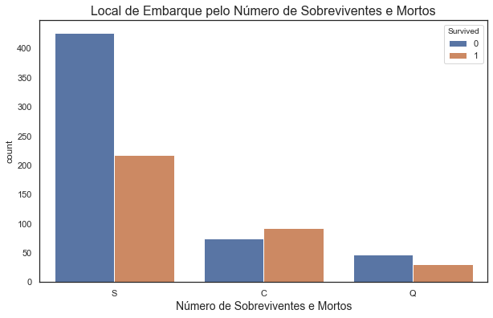


Podemos notar que quem embarcou em Southampton (S) teve aproximadamente 30% de chance de sobrevivencia, enquanto quem embarcou em Cherbourg (C) teve mais chance de sobreviver do que de morrer e quem embarcou em Queenstown (Q) teve mais chance de morrer do que de sobreviver.
Observando as características das duas passageiras acima, vemos que elas mulheres e que pagaram uma taxa de quase 85 libras, o que lhes da uma grande chance de sobrevivência. Devido a isso, decidi incluí-las no grupo que embarcou em Cherbourg (C).


```python
dfTrain.loc[dfTrain['Embarked'].isna()==True, 'Embarked'] = 'C'
dfTrain.isnull().sum()
```


    PassengerId      0
    Survived         0
    Pclass           0
    Name             0
    Sex              0
    Age              0
    SibSp            0
    Parch            0
    Ticket           0
    Fare             0
    Cabin          687
    Embarked         0
    Title            0
    AgeRange         0
    FareRange        0
    FamilySize       0
    dtype: int64


Agora vamos treinar novamente esse dataframe com a nova coluna e ver se obteremos resultados melhores.

# Algorítmos para o 3º Modelo Preditivo


```python
#Criação de X_teste1 y_teste1
X_train3 = dfTrain.loc[:, ["Sex", "Title", "AgeRange", "FareRange", "Pclass", "Embarked",  "FamilySize"]]
y_train3 = dfTrain["Survived"]
```


```python
#Fazendo a transformação das colunas do dataframe
transCol = make_column_transformer((OneHotEncoder(), ["Sex", "Title", "AgeRange", "FareRange", "Pclass", "Embarked",  "FamilySize"]),
                                   remainder='passthrough')
```

## Regressão Logística


```python
#chamando a função LogisticRegression
logreg = LogisticRegression(solver='lbfgs')

#Usando o Pipeline para unir as duas funções acima.
pipe = Pipeline([
    ('trans', transCol),
    ('clf', logreg)
])

#Definindo os possíveis parâmetros para o função.
param_grid = {'clf__penalty': ['l1','l2'], 'clf__C': [0.001,0.01,0.1,1,10,100,1000]}

#Encontrando o melhor parâmetro para a função.
logreg_grid = GridSearchCV(pipe, param_grid, cv=10, refit=True, verbose=1, n_jobs=-1)

#Treinando o algorítmo com os parâmetros escolhidos.
logreg_grid.fit(X_train3, y_train3)

#Verificando a acuracia do modelo.
logreg_grid.best_score_
```

    Fitting 10 folds for each of 14 candidates, totalling 140 fits


    [Parallel(n_jobs=-1)]: Using backend LokyBackend with 4 concurrent workers.
    [Parallel(n_jobs=-1)]: Done  56 tasks      | elapsed:    2.9s
    [Parallel(n_jobs=-1)]: Done 140 out of 140 | elapsed:    4.8s finished
    /opt/anaconda3/lib/python3.7/site-packages/sklearn/linear_model/_logistic.py:940: ConvergenceWarning: lbfgs failed to converge (status=1):
    STOP: TOTAL NO. of ITERATIONS REACHED LIMIT.
    
    Increase the number of iterations (max_iter) or scale the data as shown in:
        https://scikit-learn.org/stable/modules/preprocessing.html
    Please also refer to the documentation for alternative solver options:
        https://scikit-learn.org/stable/modules/linear_model.html#logistic-regression
      extra_warning_msg=_LOGISTIC_SOLVER_CONVERGENCE_MSG)


    0.8271785268414483


## K Nearest Neighbor (KNN)


```python
#chamando a função K Nearest Neighbor
knn = KNeighborsClassifier()

#Usando o Pipeline para unir as duas funções acima.
pipe = Pipeline([
    ('trans', transCol),
    ('clf', knn)
])

#Definindo os possíveis parâmetros para o função.
param_grid = {'clf__n_neighbors': list(range(1,31)), 'clf__weights':['uniform', 'distance']}

#Encontrando o melhor parâmetro para a função.
knn_grid = GridSearchCV(pipe, param_grid, cv=10, refit=True, verbose=1, n_jobs=-1)

#Treinando o algorítmo com os parâmetros escolhidos.
knn_grid.fit(X_train3, y_train3)

#Verificando a acuracia do modelo.
knn_grid.best_score_
```

    [Parallel(n_jobs=-1)]: Using backend LokyBackend with 4 concurrent workers.


    Fitting 10 folds for each of 60 candidates, totalling 600 fits


    [Parallel(n_jobs=-1)]: Done 128 tasks      | elapsed:    1.8s
    [Parallel(n_jobs=-1)]: Done 600 out of 600 | elapsed:    7.7s finished


    0.8282896379525593


## Support Vector Machines (SVC)


```python
#chamando a função SVC
svc = SVC()

#Usando o Pipeline para unir as duas funções acima.
pipe = Pipeline([
    ('trans', transCol),
    ('clf', svc)
])

#Definindo os possíveis parâmetros para o função.
param_grid = {'clf__C': [0.1,10, 100, 1000,5000], 'clf__gamma': [1,0.1,0.01,0.001,0.0001], 'clf__kernel': ['rbf']}

#Encontrando o melhor parâmetro para a função.
svc_grid = GridSearchCV(pipe, param_grid, cv=10, refit=True, verbose=1)

#Treinando o algorítmo com os parâmetros escolhidos.
svc_grid.fit(X_train3, y_train3)

#Verificando a acuracia do modelo.
svc_grid.best_score_
```

    [Parallel(n_jobs=1)]: Using backend SequentialBackend with 1 concurrent workers.


    Fitting 10 folds for each of 25 candidates, totalling 250 fits


    [Parallel(n_jobs=1)]: Done 250 out of 250 | elapsed:   20.7s finished


    0.8327840199750313


## Random Forest Classifier (RFC)


```python
#chamando a função RFC
rfc = RandomForestClassifier()

#Usando o Pipeline para unir as duas funções acima.
pipe = Pipeline([
    ('trans', transCol),
    ('clf', rfc)
])

#Definindo os possíveis parâmetros para o função.
param_grid = { 
    'clf__n_estimators': [200, 500],
    'clf__max_features': ['auto', 'sqrt', 'log2'],
    'clf__max_depth' : [4,5,6,7,8],
    'clf__criterion' :['gini', 'entropy']
}

#Encontrando o melhor parâmetro para a função.
rfc_grid = GridSearchCV(pipe, param_grid, cv=10, refit=True, verbose=1)

#Treinando o algorítmo com os parâmetros escolhidos.
rfc_grid.fit(X_train3,y_train3)

#Verificando a acuracia do modelo.
rfc_grid.best_score_
```

    [Parallel(n_jobs=1)]: Using backend SequentialBackend with 1 concurrent workers.


    Fitting 10 folds for each of 60 candidates, totalling 600 fits


    [Parallel(n_jobs=1)]: Done 600 out of 600 | elapsed:  8.7min finished


    0.8350062421972535


## Árvore de Decisão (Decision Tree Classifier)


```python
## Árvore de Decisão (Decision Tree Classifier)
#chamando a função Decision Tree Classifier
tree = DecisionTreeClassifier()

#Usando o Pipeline para unir as duas funções acima.
pipe = Pipeline([
    ('trans', transCol),
    ('clf', tree)
])

#Definindo os possíveis parâmetros para o função.
param_grid = {'clf__criterion':['gini','entropy'],'clf__max_depth':[4,5,6,7,8,9,10,11,12,15,20,30,40,50,70,90,120,150]}

#Encontrando o melhor parâmetro para a função.
tree_grid = GridSearchCV(pipe, param_grid, cv=20, refit=True, verbose=1)

#Treinando o algorítmo com os parâmetros escolhidos.
tree_grid.fit(X_train3, y_train3)

#Verificando a acurácia do modelo.
tree_grid.best_score_
```

    Fitting 20 folds for each of 36 candidates, totalling 720 fits


    [Parallel(n_jobs=1)]: Using backend SequentialBackend with 1 concurrent workers.
    [Parallel(n_jobs=1)]: Done 720 out of 720 | elapsed:   13.2s finished


    0.8304545454545454


Nesta terceira tentativa não obtivemos nenhum resultado relevante, sinal de que a coluna Embarked não faz tanta diferença em nossa predição. Mas enquanto eu estava analizando as duas colunas de Embarked igual a NaN percebi que existem alguns tickets que são iguais. Vamos tentar tirar algum insight dessa coluna.


```python
dfTrain.Ticket.value_counts().head(50)
```


    1601             7
    347082           7
    CA. 2343         7
    CA 2144          6
    347088           6
    3101295          6
    382652           5
    S.O.C. 14879     5
    349909           4
    17421            4
    W./C. 6608       4
    LINE             4
    2666             4
    347077           4
    19950            4
    4133             4
    113781           4
    113760           4
    PC 17757         4
    C.A. 31921       3
    24160            3
    29106            3
    PC 17572         3
    345773           3
    347742           3
    248727           3
    PC 17760         3
    363291           3
    13502            3
    PC 17582         3
    C.A. 34651       3
    239853           3
    110413           3
    PC 17755         3
    230080           3
    371110           3
    35273            3
    F.C.C. 13529     3
    SC/Paris 2123    3
    110152           3
    113806           2
    2651             2
    36928            2
    11751            2
    250655           2
    243847           2
    WE/P 5735        2
    2627             2
    364849           2
    2691             2
    Name: Ticket, dtype: int64


Não são muitos, mas vamos analizar alguns desses dados com mais repetições.
Vamos analizar esses dados em uma cópia do dataframe original, para que mantenha sua integridade.


```python
dfTrain1 = dfTrain.copy()
```


```python
dfTrain1.loc[dfTrain1.Ticket == 'CA. 2343']
```


<div>
<style scoped>
    .dataframe tbody tr th:only-of-type {
        vertical-align: middle;
    }

    .dataframe tbody tr th {
        vertical-align: top;
    }

    .dataframe thead th {
        text-align: right;
    }
</style>
<table border="1" class="dataframe">
  <thead>
    <tr style="text-align: right;">
      <th></th>
      <th>PassengerId</th>
      <th>Survived</th>
      <th>Pclass</th>
      <th>Name</th>
      <th>Sex</th>
      <th>Age</th>
      <th>SibSp</th>
      <th>Parch</th>
      <th>Ticket</th>
      <th>Fare</th>
      <th>Cabin</th>
      <th>Embarked</th>
      <th>Title</th>
      <th>AgeRange</th>
      <th>FareRange</th>
      <th>FamilySize</th>
    </tr>
  </thead>
  <tbody>
    <tr>
      <th>159</th>
      <td>160</td>
      <td>0</td>
      <td>3</td>
      <td>Sage, Master. Thomas Henry</td>
      <td>male</td>
      <td>5.0</td>
      <td>8</td>
      <td>2</td>
      <td>CA. 2343</td>
      <td>69.55</td>
      <td>NaN</td>
      <td>S</td>
      <td>Master</td>
      <td>Menos de 10</td>
      <td>45 a 85</td>
      <td>10</td>
    </tr>
    <tr>
      <th>180</th>
      <td>181</td>
      <td>0</td>
      <td>3</td>
      <td>Sage, Miss. Constance Gladys</td>
      <td>female</td>
      <td>22.0</td>
      <td>8</td>
      <td>2</td>
      <td>CA. 2343</td>
      <td>69.55</td>
      <td>NaN</td>
      <td>S</td>
      <td>Miss</td>
      <td>20 a 30</td>
      <td>45 a 85</td>
      <td>10</td>
    </tr>
    <tr>
      <th>201</th>
      <td>202</td>
      <td>0</td>
      <td>3</td>
      <td>Sage, Mr. Frederick</td>
      <td>male</td>
      <td>32.0</td>
      <td>8</td>
      <td>2</td>
      <td>CA. 2343</td>
      <td>69.55</td>
      <td>NaN</td>
      <td>S</td>
      <td>Mr</td>
      <td>30 a 40</td>
      <td>45 a 85</td>
      <td>10</td>
    </tr>
    <tr>
      <th>324</th>
      <td>325</td>
      <td>0</td>
      <td>3</td>
      <td>Sage, Mr. George John Jr</td>
      <td>male</td>
      <td>32.0</td>
      <td>8</td>
      <td>2</td>
      <td>CA. 2343</td>
      <td>69.55</td>
      <td>NaN</td>
      <td>S</td>
      <td>Mr</td>
      <td>30 a 40</td>
      <td>45 a 85</td>
      <td>10</td>
    </tr>
    <tr>
      <th>792</th>
      <td>793</td>
      <td>0</td>
      <td>3</td>
      <td>Sage, Miss. Stella Anna</td>
      <td>female</td>
      <td>22.0</td>
      <td>8</td>
      <td>2</td>
      <td>CA. 2343</td>
      <td>69.55</td>
      <td>NaN</td>
      <td>S</td>
      <td>Miss</td>
      <td>20 a 30</td>
      <td>45 a 85</td>
      <td>10</td>
    </tr>
    <tr>
      <th>846</th>
      <td>847</td>
      <td>0</td>
      <td>3</td>
      <td>Sage, Mr. Douglas Bullen</td>
      <td>male</td>
      <td>32.0</td>
      <td>8</td>
      <td>2</td>
      <td>CA. 2343</td>
      <td>69.55</td>
      <td>NaN</td>
      <td>S</td>
      <td>Mr</td>
      <td>30 a 40</td>
      <td>45 a 85</td>
      <td>10</td>
    </tr>
    <tr>
      <th>863</th>
      <td>864</td>
      <td>0</td>
      <td>3</td>
      <td>Sage, Miss. Dorothy Edith "Dolly"</td>
      <td>female</td>
      <td>22.0</td>
      <td>8</td>
      <td>2</td>
      <td>CA. 2343</td>
      <td>69.55</td>
      <td>NaN</td>
      <td>S</td>
      <td>Miss</td>
      <td>20 a 30</td>
      <td>45 a 85</td>
      <td>10</td>
    </tr>
  </tbody>
</table>
</div>


```python
dfTrain1.loc[dfTrain1.Ticket == '1601']
```


<div>
<style scoped>
    .dataframe tbody tr th:only-of-type {
        vertical-align: middle;
    }

    .dataframe tbody tr th {
        vertical-align: top;
    }

    .dataframe thead th {
        text-align: right;
    }
</style>
<table border="1" class="dataframe">
  <thead>
    <tr style="text-align: right;">
      <th></th>
      <th>PassengerId</th>
      <th>Survived</th>
      <th>Pclass</th>
      <th>Name</th>
      <th>Sex</th>
      <th>Age</th>
      <th>SibSp</th>
      <th>Parch</th>
      <th>Ticket</th>
      <th>Fare</th>
      <th>Cabin</th>
      <th>Embarked</th>
      <th>Title</th>
      <th>AgeRange</th>
      <th>FareRange</th>
      <th>FamilySize</th>
    </tr>
  </thead>
  <tbody>
    <tr>
      <th>74</th>
      <td>75</td>
      <td>1</td>
      <td>3</td>
      <td>Bing, Mr. Lee</td>
      <td>male</td>
      <td>32.0</td>
      <td>0</td>
      <td>0</td>
      <td>1601</td>
      <td>56.4958</td>
      <td>NaN</td>
      <td>S</td>
      <td>Mr</td>
      <td>30 a 40</td>
      <td>45 a 85</td>
      <td>0</td>
    </tr>
    <tr>
      <th>169</th>
      <td>170</td>
      <td>0</td>
      <td>3</td>
      <td>Ling, Mr. Lee</td>
      <td>male</td>
      <td>28.0</td>
      <td>0</td>
      <td>0</td>
      <td>1601</td>
      <td>56.4958</td>
      <td>NaN</td>
      <td>S</td>
      <td>Mr</td>
      <td>20 a 30</td>
      <td>45 a 85</td>
      <td>0</td>
    </tr>
    <tr>
      <th>509</th>
      <td>510</td>
      <td>1</td>
      <td>3</td>
      <td>Lang, Mr. Fang</td>
      <td>male</td>
      <td>26.0</td>
      <td>0</td>
      <td>0</td>
      <td>1601</td>
      <td>56.4958</td>
      <td>NaN</td>
      <td>S</td>
      <td>Mr</td>
      <td>20 a 30</td>
      <td>45 a 85</td>
      <td>0</td>
    </tr>
    <tr>
      <th>643</th>
      <td>644</td>
      <td>1</td>
      <td>3</td>
      <td>Foo, Mr. Choong</td>
      <td>male</td>
      <td>32.0</td>
      <td>0</td>
      <td>0</td>
      <td>1601</td>
      <td>56.4958</td>
      <td>NaN</td>
      <td>S</td>
      <td>Mr</td>
      <td>30 a 40</td>
      <td>45 a 85</td>
      <td>0</td>
    </tr>
    <tr>
      <th>692</th>
      <td>693</td>
      <td>1</td>
      <td>3</td>
      <td>Lam, Mr. Ali</td>
      <td>male</td>
      <td>32.0</td>
      <td>0</td>
      <td>0</td>
      <td>1601</td>
      <td>56.4958</td>
      <td>NaN</td>
      <td>S</td>
      <td>Mr</td>
      <td>30 a 40</td>
      <td>45 a 85</td>
      <td>0</td>
    </tr>
    <tr>
      <th>826</th>
      <td>827</td>
      <td>0</td>
      <td>3</td>
      <td>Lam, Mr. Len</td>
      <td>male</td>
      <td>32.0</td>
      <td>0</td>
      <td>0</td>
      <td>1601</td>
      <td>56.4958</td>
      <td>NaN</td>
      <td>S</td>
      <td>Mr</td>
      <td>30 a 40</td>
      <td>45 a 85</td>
      <td>0</td>
    </tr>
    <tr>
      <th>838</th>
      <td>839</td>
      <td>1</td>
      <td>3</td>
      <td>Chip, Mr. Chang</td>
      <td>male</td>
      <td>32.0</td>
      <td>0</td>
      <td>0</td>
      <td>1601</td>
      <td>56.4958</td>
      <td>NaN</td>
      <td>S</td>
      <td>Mr</td>
      <td>30 a 40</td>
      <td>45 a 85</td>
      <td>0</td>
    </tr>
  </tbody>
</table>
</div>


```python
dfTrain1.loc[dfTrain1.Ticket == '347082']
```


<div>
<style scoped>
    .dataframe tbody tr th:only-of-type {
        vertical-align: middle;
    }

    .dataframe tbody tr th {
        vertical-align: top;
    }

    .dataframe thead th {
        text-align: right;
    }
</style>
<table border="1" class="dataframe">
  <thead>
    <tr style="text-align: right;">
      <th></th>
      <th>PassengerId</th>
      <th>Survived</th>
      <th>Pclass</th>
      <th>Name</th>
      <th>Sex</th>
      <th>Age</th>
      <th>SibSp</th>
      <th>Parch</th>
      <th>Ticket</th>
      <th>Fare</th>
      <th>Cabin</th>
      <th>Embarked</th>
      <th>Title</th>
      <th>AgeRange</th>
      <th>FareRange</th>
      <th>FamilySize</th>
    </tr>
  </thead>
  <tbody>
    <tr>
      <th>13</th>
      <td>14</td>
      <td>0</td>
      <td>3</td>
      <td>Andersson, Mr. Anders Johan</td>
      <td>male</td>
      <td>39.0</td>
      <td>1</td>
      <td>5</td>
      <td>347082</td>
      <td>31.275</td>
      <td>NaN</td>
      <td>S</td>
      <td>Mr</td>
      <td>30 a 40</td>
      <td>17 a 45</td>
      <td>6</td>
    </tr>
    <tr>
      <th>119</th>
      <td>120</td>
      <td>0</td>
      <td>3</td>
      <td>Andersson, Miss. Ellis Anna Maria</td>
      <td>female</td>
      <td>2.0</td>
      <td>4</td>
      <td>2</td>
      <td>347082</td>
      <td>31.275</td>
      <td>NaN</td>
      <td>S</td>
      <td>Miss</td>
      <td>Menos de 10</td>
      <td>17 a 45</td>
      <td>6</td>
    </tr>
    <tr>
      <th>541</th>
      <td>542</td>
      <td>0</td>
      <td>3</td>
      <td>Andersson, Miss. Ingeborg Constanzia</td>
      <td>female</td>
      <td>9.0</td>
      <td>4</td>
      <td>2</td>
      <td>347082</td>
      <td>31.275</td>
      <td>NaN</td>
      <td>S</td>
      <td>Miss</td>
      <td>Menos de 10</td>
      <td>17 a 45</td>
      <td>6</td>
    </tr>
    <tr>
      <th>542</th>
      <td>543</td>
      <td>0</td>
      <td>3</td>
      <td>Andersson, Miss. Sigrid Elisabeth</td>
      <td>female</td>
      <td>11.0</td>
      <td>4</td>
      <td>2</td>
      <td>347082</td>
      <td>31.275</td>
      <td>NaN</td>
      <td>S</td>
      <td>Miss</td>
      <td>10 a 20</td>
      <td>17 a 45</td>
      <td>6</td>
    </tr>
    <tr>
      <th>610</th>
      <td>611</td>
      <td>0</td>
      <td>3</td>
      <td>Andersson, Mrs. Anders Johan (Alfrida Konstant...</td>
      <td>female</td>
      <td>39.0</td>
      <td>1</td>
      <td>5</td>
      <td>347082</td>
      <td>31.275</td>
      <td>NaN</td>
      <td>S</td>
      <td>Mrs</td>
      <td>30 a 40</td>
      <td>17 a 45</td>
      <td>6</td>
    </tr>
    <tr>
      <th>813</th>
      <td>814</td>
      <td>0</td>
      <td>3</td>
      <td>Andersson, Miss. Ebba Iris Alfrida</td>
      <td>female</td>
      <td>6.0</td>
      <td>4</td>
      <td>2</td>
      <td>347082</td>
      <td>31.275</td>
      <td>NaN</td>
      <td>S</td>
      <td>Miss</td>
      <td>Menos de 10</td>
      <td>17 a 45</td>
      <td>6</td>
    </tr>
    <tr>
      <th>850</th>
      <td>851</td>
      <td>0</td>
      <td>3</td>
      <td>Andersson, Master. Sigvard Harald Elias</td>
      <td>male</td>
      <td>4.0</td>
      <td>4</td>
      <td>2</td>
      <td>347082</td>
      <td>31.275</td>
      <td>NaN</td>
      <td>S</td>
      <td>Master</td>
      <td>Menos de 10</td>
      <td>17 a 45</td>
      <td>6</td>
    </tr>
  </tbody>
</table>
</div>


Se olharmos para esses 3 datasets podemos ver que em dois deles, os tickets pertencem a mesma família e no segundo a um grupo de chineses. Nos datasets com os passageiros da mesma famíli todos morreram, mas isso ja tinhamos visto no gráfico de FamilySize.
Uma falha que eu cometi durante as análises, por falta de intepretação foi que a taxa "Fare" de um ticket é apenas uma. Então o certo seria dividir essa taxa pelo número de tickets iguais. Vamos fazer essa alterção e ver o se conseguimos uma divisão melhor e mais clara pela taxa (Fare).


```python
#Criando um dicionário de ticket e quantidade
numeroDeTickets = dict(dfTrain1.Ticket.value_counts())
```

Vamos criar a coluna "NumTickets", que nos dará a quantidade de tickets iguais que ele possui.


```python
dfTrain1["NumTickets"] = dfTrain1["Ticket"].map(numeroDeTickets)
dfTrain1.head()
```


<div>
<style scoped>
    .dataframe tbody tr th:only-of-type {
        vertical-align: middle;
    }

    .dataframe tbody tr th {
        vertical-align: top;
    }

    .dataframe thead th {
        text-align: right;
    }
</style>
<table border="1" class="dataframe">
  <thead>
    <tr style="text-align: right;">
      <th></th>
      <th>PassengerId</th>
      <th>Survived</th>
      <th>Pclass</th>
      <th>Name</th>
      <th>Sex</th>
      <th>Age</th>
      <th>SibSp</th>
      <th>Parch</th>
      <th>Ticket</th>
      <th>Fare</th>
      <th>Cabin</th>
      <th>Embarked</th>
      <th>Title</th>
      <th>AgeRange</th>
      <th>FareRange</th>
      <th>FamilySize</th>
      <th>NumTickets</th>
    </tr>
  </thead>
  <tbody>
    <tr>
      <th>0</th>
      <td>1</td>
      <td>0</td>
      <td>3</td>
      <td>Braund, Mr. Owen Harris</td>
      <td>male</td>
      <td>22.0</td>
      <td>1</td>
      <td>0</td>
      <td>A/5 21171</td>
      <td>7.2500</td>
      <td>NaN</td>
      <td>S</td>
      <td>Mr</td>
      <td>20 a 30</td>
      <td>Menos de 17</td>
      <td>1</td>
      <td>1</td>
    </tr>
    <tr>
      <th>1</th>
      <td>2</td>
      <td>1</td>
      <td>1</td>
      <td>Cumings, Mrs. John Bradley (Florence Briggs Th...</td>
      <td>female</td>
      <td>38.0</td>
      <td>1</td>
      <td>0</td>
      <td>PC 17599</td>
      <td>71.2833</td>
      <td>C85</td>
      <td>C</td>
      <td>Mrs</td>
      <td>30 a 40</td>
      <td>45 a 85</td>
      <td>1</td>
      <td>1</td>
    </tr>
    <tr>
      <th>2</th>
      <td>3</td>
      <td>1</td>
      <td>3</td>
      <td>Heikkinen, Miss. Laina</td>
      <td>female</td>
      <td>26.0</td>
      <td>0</td>
      <td>0</td>
      <td>STON/O2. 3101282</td>
      <td>7.9250</td>
      <td>NaN</td>
      <td>S</td>
      <td>Miss</td>
      <td>20 a 30</td>
      <td>Menos de 17</td>
      <td>0</td>
      <td>1</td>
    </tr>
    <tr>
      <th>3</th>
      <td>4</td>
      <td>1</td>
      <td>1</td>
      <td>Futrelle, Mrs. Jacques Heath (Lily May Peel)</td>
      <td>female</td>
      <td>35.0</td>
      <td>1</td>
      <td>0</td>
      <td>113803</td>
      <td>53.1000</td>
      <td>C123</td>
      <td>S</td>
      <td>Mrs</td>
      <td>30 a 40</td>
      <td>45 a 85</td>
      <td>1</td>
      <td>2</td>
    </tr>
    <tr>
      <th>4</th>
      <td>5</td>
      <td>0</td>
      <td>3</td>
      <td>Allen, Mr. William Henry</td>
      <td>male</td>
      <td>35.0</td>
      <td>0</td>
      <td>0</td>
      <td>373450</td>
      <td>8.0500</td>
      <td>NaN</td>
      <td>S</td>
      <td>Mr</td>
      <td>30 a 40</td>
      <td>Menos de 17</td>
      <td>0</td>
      <td>1</td>
    </tr>
  </tbody>
</table>
</div>


Vamos criar também a coluna "RealFare", que terá a taxa "Real" paga pelo passageiro.


```python
dfTrain1["RealFare"] = dfTrain1["Fare"] / dfTrain1["NumTickets"]
dfTrain1.head()
```


<div>
<style scoped>
    .dataframe tbody tr th:only-of-type {
        vertical-align: middle;
    }

    .dataframe tbody tr th {
        vertical-align: top;
    }

    .dataframe thead th {
        text-align: right;
    }
</style>
<table border="1" class="dataframe">
  <thead>
    <tr style="text-align: right;">
      <th></th>
      <th>PassengerId</th>
      <th>Survived</th>
      <th>Pclass</th>
      <th>Name</th>
      <th>Sex</th>
      <th>Age</th>
      <th>SibSp</th>
      <th>Parch</th>
      <th>Ticket</th>
      <th>Fare</th>
      <th>Cabin</th>
      <th>Embarked</th>
      <th>Title</th>
      <th>AgeRange</th>
      <th>FareRange</th>
      <th>FamilySize</th>
      <th>NumTickets</th>
      <th>RealFare</th>
    </tr>
  </thead>
  <tbody>
    <tr>
      <th>0</th>
      <td>1</td>
      <td>0</td>
      <td>3</td>
      <td>Braund, Mr. Owen Harris</td>
      <td>male</td>
      <td>22.0</td>
      <td>1</td>
      <td>0</td>
      <td>A/5 21171</td>
      <td>7.2500</td>
      <td>NaN</td>
      <td>S</td>
      <td>Mr</td>
      <td>20 a 30</td>
      <td>Menos de 17</td>
      <td>1</td>
      <td>1</td>
      <td>7.2500</td>
    </tr>
    <tr>
      <th>1</th>
      <td>2</td>
      <td>1</td>
      <td>1</td>
      <td>Cumings, Mrs. John Bradley (Florence Briggs Th...</td>
      <td>female</td>
      <td>38.0</td>
      <td>1</td>
      <td>0</td>
      <td>PC 17599</td>
      <td>71.2833</td>
      <td>C85</td>
      <td>C</td>
      <td>Mrs</td>
      <td>30 a 40</td>
      <td>45 a 85</td>
      <td>1</td>
      <td>1</td>
      <td>71.2833</td>
    </tr>
    <tr>
      <th>2</th>
      <td>3</td>
      <td>1</td>
      <td>3</td>
      <td>Heikkinen, Miss. Laina</td>
      <td>female</td>
      <td>26.0</td>
      <td>0</td>
      <td>0</td>
      <td>STON/O2. 3101282</td>
      <td>7.9250</td>
      <td>NaN</td>
      <td>S</td>
      <td>Miss</td>
      <td>20 a 30</td>
      <td>Menos de 17</td>
      <td>0</td>
      <td>1</td>
      <td>7.9250</td>
    </tr>
    <tr>
      <th>3</th>
      <td>4</td>
      <td>1</td>
      <td>1</td>
      <td>Futrelle, Mrs. Jacques Heath (Lily May Peel)</td>
      <td>female</td>
      <td>35.0</td>
      <td>1</td>
      <td>0</td>
      <td>113803</td>
      <td>53.1000</td>
      <td>C123</td>
      <td>S</td>
      <td>Mrs</td>
      <td>30 a 40</td>
      <td>45 a 85</td>
      <td>1</td>
      <td>2</td>
      <td>26.5500</td>
    </tr>
    <tr>
      <th>4</th>
      <td>5</td>
      <td>0</td>
      <td>3</td>
      <td>Allen, Mr. William Henry</td>
      <td>male</td>
      <td>35.0</td>
      <td>0</td>
      <td>0</td>
      <td>373450</td>
      <td>8.0500</td>
      <td>NaN</td>
      <td>S</td>
      <td>Mr</td>
      <td>30 a 40</td>
      <td>Menos de 17</td>
      <td>0</td>
      <td>1</td>
      <td>8.0500</td>
    </tr>
  </tbody>
</table>
</div>


```python
dfTrain1.RealFare
```


    0       7.2500
    1      71.2833
    2       7.9250
    3      26.5500
    4       8.0500
            ...   
    886    13.0000
    887    30.0000
    888    11.7250
    889    30.0000
    890     7.7500
    Name: RealFare, Length: 891, dtype: float64


Vamos fazer novamente a análise de mortos e sobrevivente pelo número "real" pago ticket e com a idade de cada passageiro.


```python
#Criando os datasets
maisDe85 = dfTrain1.query('RealFare > 85')
menosDe85 = dfTrain1.query('RealFare <=85')

fig, ax = plt.subplots(1,2,figsize=(16,6))
sns.scatterplot(x=menosDe85.RealFare, y=menosDe85.Age, hue=menosDe85.Survived, data=menosDe85, ax=ax[0])
ax[0].set_title('Taxa pela Idade com a identificação de Mortos de Sobrviventes', fontsize=14)
ax[0].xaxis.set_label_text("Taxa", fontsize=14)
ax[0].yaxis.set_label_text("Idade", fontsize=14)
sns.scatterplot(x=maisDe85.RealFare, y=maisDe85.Age, hue=maisDe85.Survived, data=maisDe85, ax=ax[1])
ax[1].set_title('Taxa pela Idade com a identificação de Mortos de Sobrviventes', fontsize=14)
ax[1].xaxis.set_label_text("Taxa", fontsize=14)
ax[1].yaxis.set_label_text("Idade", fontsize=14)
plt.show()
```


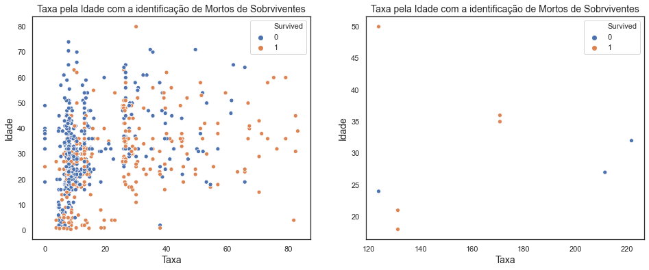


Vamos divir este gráfico em três partes:


```python
#Criando os datasets
maisDe85 = dfTrain1.query('RealFare > 65')
entre65e25 = dfTrain1.query(f'RealFare <=65 & RealFare >20')
menosDe85 = dfTrain1.query('RealFare <=20')

fig, ax = plt.subplots(1,2,figsize=(16,6))
sns.scatterplot(x=menosDe85.RealFare, y=menosDe85.Age, hue=menosDe85.Survived, data=menosDe85, ax=ax[0])
ax[0].set_title('Taxa pela Idade com a identificação de Mortos de Sobrviventes', fontsize=14)
ax[0].xaxis.set_label_text("Taxa", fontsize=14)
ax[0].yaxis.set_label_text("Idade", fontsize=14)
sns.scatterplot(x=entre65e25.RealFare, y=entre65e25.Age, hue=entre65e25.Survived, data=entre65e25, ax=ax[1])
ax[1].set_title('Taxa pela Idade com a identificação de Mortos de Sobrviventes', fontsize=14)
ax[1].xaxis.set_label_text("Taxa", fontsize=14)
ax[1].yaxis.set_label_text("Idade", fontsize=14)
plt.show()
fig, ax = plt.subplots(1,1,figsize=(7.3,6))
sns.scatterplot(x=maisDe85.RealFare, y=maisDe85.Age, hue=maisDe85.Survived, data=maisDe85)
ax.set_title('Taxa pela Idade com a identificação de Mortos de Sobrviventes', fontsize=14)
ax.xaxis.set_label_text("Taxa", fontsize=14)
ax.yaxis.set_label_text("Idade", fontsize=14)
plt.show()
```


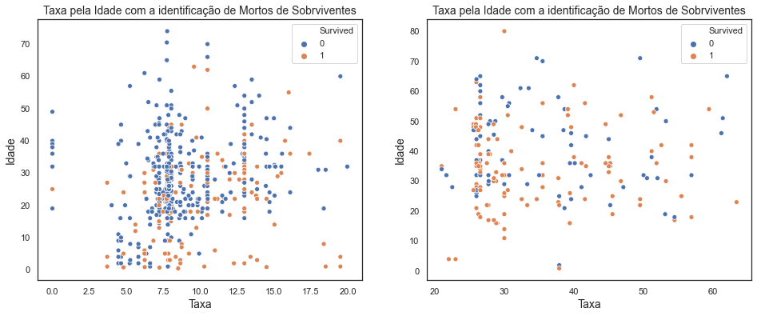


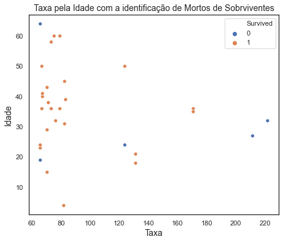


Acho que essa divisão ficou mais justa, vamos mudar os valores novamente na coluna FareRange e ver se nosso algoritmo nos da uma resposta melhor.


```python
#Exlcuindo a coluna FareRange
#dfTrain1.drop(columns = ['FareRange'], inplace=True)
```


```python
#Criando novamente a coluna FareRange
bins = [-1, 19.999, 64.999, 999]
valorTicket = ['Menos de 20','20 a 65', 'Mais de 65']
dfTrain1['FareRange'] = pd.cut(dfTrain1['RealFare'], bins, labels=valorTicket)
dfTrain1.head()
```


<div>
<style scoped>
    .dataframe tbody tr th:only-of-type {
        vertical-align: middle;
    }

    .dataframe tbody tr th {
        vertical-align: top;
    }

    .dataframe thead th {
        text-align: right;
    }
</style>
<table border="1" class="dataframe">
  <thead>
    <tr style="text-align: right;">
      <th></th>
      <th>PassengerId</th>
      <th>Survived</th>
      <th>Pclass</th>
      <th>Name</th>
      <th>Sex</th>
      <th>Age</th>
      <th>SibSp</th>
      <th>Parch</th>
      <th>Ticket</th>
      <th>Fare</th>
      <th>Cabin</th>
      <th>Embarked</th>
      <th>Title</th>
      <th>AgeRange</th>
      <th>FareRange</th>
      <th>FamilySize</th>
      <th>NumTickets</th>
      <th>RealFare</th>
    </tr>
  </thead>
  <tbody>
    <tr>
      <th>0</th>
      <td>1</td>
      <td>0</td>
      <td>3</td>
      <td>Braund, Mr. Owen Harris</td>
      <td>male</td>
      <td>22.0</td>
      <td>1</td>
      <td>0</td>
      <td>A/5 21171</td>
      <td>7.2500</td>
      <td>NaN</td>
      <td>S</td>
      <td>Mr</td>
      <td>20 a 30</td>
      <td>Menos de 20</td>
      <td>1</td>
      <td>1</td>
      <td>7.2500</td>
    </tr>
    <tr>
      <th>1</th>
      <td>2</td>
      <td>1</td>
      <td>1</td>
      <td>Cumings, Mrs. John Bradley (Florence Briggs Th...</td>
      <td>female</td>
      <td>38.0</td>
      <td>1</td>
      <td>0</td>
      <td>PC 17599</td>
      <td>71.2833</td>
      <td>C85</td>
      <td>C</td>
      <td>Mrs</td>
      <td>30 a 40</td>
      <td>Mais de 65</td>
      <td>1</td>
      <td>1</td>
      <td>71.2833</td>
    </tr>
    <tr>
      <th>2</th>
      <td>3</td>
      <td>1</td>
      <td>3</td>
      <td>Heikkinen, Miss. Laina</td>
      <td>female</td>
      <td>26.0</td>
      <td>0</td>
      <td>0</td>
      <td>STON/O2. 3101282</td>
      <td>7.9250</td>
      <td>NaN</td>
      <td>S</td>
      <td>Miss</td>
      <td>20 a 30</td>
      <td>Menos de 20</td>
      <td>0</td>
      <td>1</td>
      <td>7.9250</td>
    </tr>
    <tr>
      <th>3</th>
      <td>4</td>
      <td>1</td>
      <td>1</td>
      <td>Futrelle, Mrs. Jacques Heath (Lily May Peel)</td>
      <td>female</td>
      <td>35.0</td>
      <td>1</td>
      <td>0</td>
      <td>113803</td>
      <td>53.1000</td>
      <td>C123</td>
      <td>S</td>
      <td>Mrs</td>
      <td>30 a 40</td>
      <td>20 a 65</td>
      <td>1</td>
      <td>2</td>
      <td>26.5500</td>
    </tr>
    <tr>
      <th>4</th>
      <td>5</td>
      <td>0</td>
      <td>3</td>
      <td>Allen, Mr. William Henry</td>
      <td>male</td>
      <td>35.0</td>
      <td>0</td>
      <td>0</td>
      <td>373450</td>
      <td>8.0500</td>
      <td>NaN</td>
      <td>S</td>
      <td>Mr</td>
      <td>30 a 40</td>
      <td>Menos de 20</td>
      <td>0</td>
      <td>1</td>
      <td>8.0500</td>
    </tr>
  </tbody>
</table>
</div>


# Algorítmos para o 3º Modelo Preditivo (segunda vez)


```python
from sklearn.preprocessing import StandardScaler
```


```python
#Criação de X_teste1 y_teste1
X_train3 = dfTrain1.loc[:, ["Sex", "Title", "AgeRange", "FareRange", "Pclass", "Embarked", "FamilySize"]]
y_train3 = dfTrain1["Survived"]
```


```python
#Fazendo a transformação das colunas do dataframe
transCol = make_column_transformer((OneHotEncoder(), ["Sex", "Title", "AgeRange", "FareRange", "Pclass", "Embarked", "FamilySize"]),
                                   remainder='passthrough')
```

## Regressão Logística


```python
#chamando a função LogisticRegression
logreg = LogisticRegression(solver='lbfgs')

#Usando o Pipeline para unir as duas funções acima.
pipe = Pipeline([
    ('trans', transCol),
    ('clf', logreg)
])

#Definindo os possíveis parâmetros para o função.
param_grid = {'clf__penalty': ['l1','l2'], 'clf__C': [0.001,0.01,0.1,1,10,100,1000]}

#Encontrando o melhor parâmetro para a função.
logreg_grid = GridSearchCV(pipe, param_grid, cv=10, refit=True, verbose=1, n_jobs=-1)

#Treinando o algorítmo com os parâmetros escolhidos.
logreg_grid.fit(X_train3, y_train3)

#Verificando a acuracia do modelo.
logreg_grid.best_score_
```

    Fitting 10 folds for each of 14 candidates, totalling 140 fits


    [Parallel(n_jobs=-1)]: Using backend LokyBackend with 4 concurrent workers.
    [Parallel(n_jobs=-1)]: Done  56 tasks      | elapsed:    3.9s
    [Parallel(n_jobs=-1)]: Done 140 out of 140 | elapsed:    5.3s finished
    /opt/anaconda3/lib/python3.7/site-packages/sklearn/linear_model/_logistic.py:940: ConvergenceWarning: lbfgs failed to converge (status=1):
    STOP: TOTAL NO. of ITERATIONS REACHED LIMIT.
    
    Increase the number of iterations (max_iter) or scale the data as shown in:
        https://scikit-learn.org/stable/modules/preprocessing.html
    Please also refer to the documentation for alternative solver options:
        https://scikit-learn.org/stable/modules/linear_model.html#logistic-regression
      extra_warning_msg=_LOGISTIC_SOLVER_CONVERGENCE_MSG)


    0.8316479400749064


## K Nearest Neighbor (KNN)


```python
#chamando a função K Nearest Neighbor
knn = KNeighborsClassifier()

#Usando o Pipeline para unir as duas funções acima.
pipe = Pipeline([
    ('trans', transCol),
    ('clf', knn)
])

#Definindo os possíveis parâmetros para o função.
param_grid = {'clf__n_neighbors': list(range(1,31)), 'clf__weights':['uniform', 'distance']}

#Encontrando o melhor parâmetro para a função.
knn_grid = GridSearchCV(pipe, param_grid, cv=10, refit=True, verbose=1, n_jobs=-1)

#Treinando o algorítmo com os parâmetros escolhidos.
knn_grid.fit(X_train3, y_train3)

#Verificando a acuracia do modelo.
knn_grid.best_score_
```

    [Parallel(n_jobs=-1)]: Using backend LokyBackend with 4 concurrent workers.


    Fitting 10 folds for each of 60 candidates, totalling 600 fits


    [Parallel(n_jobs=-1)]: Done  80 tasks      | elapsed:    1.5s
    [Parallel(n_jobs=-1)]: Done 600 out of 600 | elapsed:    7.8s finished


    0.8215730337078652


## Support Vector Machines (SVC)


```python
#chamando a função SVC
svc = SVC()

#Usando o Pipeline para unir as duas funções acima.
pipe = Pipeline([
    ('trans', transCol),
    ('clf', svc)
])

#Definindo os possíveis parâmetros para o função.
param_grid = {'clf__C': [0.1,10, 100, 1000,5000], 'clf__gamma': [1,0.1,0.01,0.001,0.0001], 'clf__kernel': ['rbf']}

#Encontrando o melhor parâmetro para a função.
svc_grid = GridSearchCV(pipe, param_grid, cv=10, refit=True, verbose=1)

#Treinando o algorítmo com os parâmetros escolhidos.
svc_grid.fit(X_train3, y_train3)

#Verificando a acuracia do modelo.
svc_grid.best_score_
```

    [Parallel(n_jobs=1)]: Using backend SequentialBackend with 1 concurrent workers.


    Fitting 10 folds for each of 25 candidates, totalling 250 fits


    [Parallel(n_jobs=1)]: Done 250 out of 250 | elapsed:   20.3s finished


    0.8327715355805243


## Árvore de Decisão (Decision Tree Classifier)


```python
#chamando a função Decision Tree Classifier
tree = DecisionTreeClassifier()

#Usando o Pipeline para unir as duas funções acima.
pipe = Pipeline([
    ('trans', transCol),
    ('clf', tree)
])

#Definindo os possíveis parâmetros para o função.
param_grid = {'clf__criterion':['gini','entropy'],'clf__max_depth':[4,5,6,7,8,9,10,11,12,15,20,30,40,50,70,90,120,150]}

#Encontrando o melhor parâmetro para a função.
tree_grid = GridSearchCV(pipe, param_grid, cv=20, refit=True, verbose=1)

#Treinando o algorítmo com os parâmetros escolhidos.
tree_grid.fit(X_train3, y_train3)

#Verificando a acurácia do modelo.
tree_grid.best_score_
```

    [Parallel(n_jobs=1)]: Using backend SequentialBackend with 1 concurrent workers.


    Fitting 20 folds for each of 36 candidates, totalling 720 fits


    [Parallel(n_jobs=1)]: Done 720 out of 720 | elapsed:   14.5s finished


    0.8292929292929292


Olhando para os resultados até agora, eles são satisfatórios. Acredito que para minha primeira experiência com data science foi um ótimo exercício e fiquei bastante empolgado para os próximos desafios que virão pela frente.
